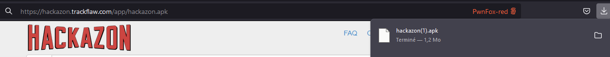
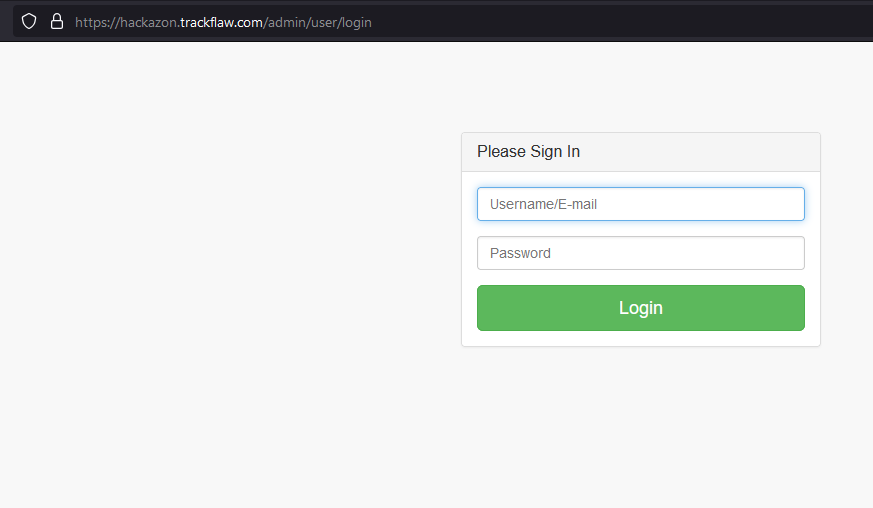
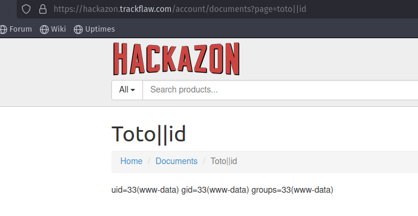
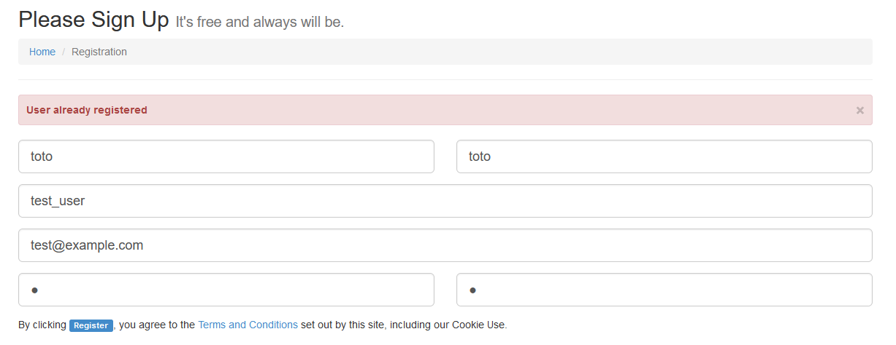
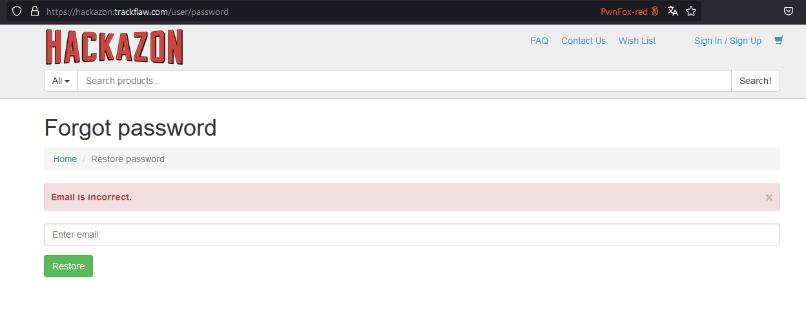

# SOMMAIRE

1. [Préambule](#préambule)
    1.1 [Présentation des résultats](#présentation-des-résultats)  
    1.2 [Contexte](#contexte)  
    1.3 [Pilotage de la prestation](#pilotage-de-la-prestation)  
    1.4 [Actions de nettoyage recommandées](#actions-de-nettoyage-recommandées)

2. [Synthèse Managériale](#synthèse-managériale)
    2.1 [Synthèse générale](#synthèse-générale)
    2.2 [Synthèse des risques](#synthèse-des-risques)
    2.3 [Synthèse des vulnérabilités et recommandations](#synthèse-des-vulnérabilités-et-recommandations)
    2.4 [Remarques](#remarques)

3. [Synthèse Technique](#synthèse-technique)

4. [Test d'intrusion externe et applicatif](#test-dintrusion-externe-et-applicatif)

    4.1 [Évaluation infrastructure](#évaluation-infrastructure)
        4.1.1 [Réseau](#réseau)
        4.1.2 [Services](#services)

    4.2 [Application web](#application-web)  
        4.2.2 [Évaluation application](#évaluation-application)  
            - Collecte d'informations  
            - Configuration et mécanismes de déploiement  
            - Gestion des identités  
            - Authentification  
            - Autorisations  
            - Gestion des sessions  
            - Validation des entrées utilisateurs  
            - Gestion des erreurs  
            - Cryptographie  
            - Processus métier  
            - Côté client

5. [Annexe](#annexe)  
    5.1 [Présentation de la démarche](#présentation-de-la-démarche)
    5.2 [Présentation des résultats](#présentation-des-résultats-annexe)
    5.3 [Terminologie des risques](#terminologie-des-risques)


# 1. Préambule

## 1.1 Présentation des résultats

> FIXME: Brief introduction to the findings, summarizing the key takeaways.


## 1.2 Contexte

Dans le cadre de cette mission, il nous a été demandé de réaliser un test d'intrusion sur l'application web **Hackazon** accessible via l'URL [https://hackazon.trackflaw.com/](https://hackazon.trackflaw.com/). Hackazon est une plateforme de test et d'évaluation de la sécurité, souvent utilisée pour simuler des scénarios d'attaques web afin d'améliorer les pratiques de sécurisation des applications.

Le test d'intrusion avait pour objectif d’identifier les vulnérabilités potentielles de l’application et de fournir des recommandations en matière de sécurité. Ce test s'inscrit dans une démarche d'amélioration continue de la sécurité de l'infrastructure et des applications exposées à des utilisateurs externes.

### Objectifs principaux :
- Identifier et analyser les vulnérabilités présentes sur l’application web Hackazon.
- Évaluer la sécurité de l'infrastructure sous-jacente (serveurs, services réseau).
- Proposer des recommandations pour la remédiation des vulnérabilités détectées.

### Portée du test :
Le test a principalement couvert deux aspects :

1. **L'infrastructure** : Évaluation de la configuration réseau, des services exposés, et des mécanismes de protection en place.

2. **L’application web** : Analyse des points d’entrée de l'application, de la gestion des identités, des sessions, et des mécanismes de validation des entrées utilisateurs.


### Contraintes :
- Le temps alloué pour cette prestation était limité, ce qui a restreint l’analyse exhaustive de tous les points d’entrée possibles.
- Aucun accès aux codes sources de l'application ou aux serveurs hébergeant l'application n'a été fourni. Le test a été réalisé dans une approche « boîte noire », simulant l'attaque d'un utilisateur malveillant sans connaissances internes sur l'application.


## 1.3 Pilotage de la Prestation

Le pilotage de cette mission a suivi une approche structurée afin d'assurer une exécution fluide et alignée sur les attentes du client. Le test d’intrusion a été réalisé en plusieurs phases, chacune encadrée par des points de contact réguliers avec le client pour garantir la transparence et la bonne progression du projet.

### Phases de la mission :
1. **Phase de préparation** :
   - Recueil des besoins du client et définition du périmètre du test.
   - Planification des outils et méthodes à utiliser pour le test d'intrusion.
   - Configuration d’un environnement sécurisé pour l'exécution des tests.

2. **Phase de tests** :
   - Réalisation des tests d’intrusion en suivant une approche **boîte noire**, simulant le comportement d’un attaquant sans accès aux informations internes.
   - Utilisation d’outils automatisés et manuels pour identifier les vulnérabilités potentielles, notamment :
     - Outils de scan de vulnérabilités (ex. **SQLMap**, **Nmap**).
     - Analyse manuelle des points d’entrée utilisateur et des services exposés.

3. **Phase d’analyse** :
   - Analyse approfondie des résultats obtenus durant les tests pour en extraire les vulnérabilités les plus critiques.
   - Classement des vulnérabilités selon leur impact, leur facilité d’exploitation et leur sévérité.

4. **Phase de restitution** :
   - Présentation des résultats sous forme de rapport détaillé, incluant les vulnérabilités détectées et les recommandations associées.
   - Discussion avec le client pour clarifier certains points, notamment les priorités en matière de remédiation.

### Points de contact et communication :

- Un compte-rendu final a été livré sous forme de rapport détaillé, avec une synthèse managériale et une synthèse technique.


## 1.4 Actions de nettoyage recommandées

> FIXME: Recommendations for post-pentest cleanup actions, including removing test accounts, resetting passwords, or patching vulnerabilities.

# 2. Synthèse Managériale

## 2.1 Synthèse générale

> FIXME: General summary of the findings and their potential impact on the business.

## 2.2 Synthèse des risques

> FIXME: Overview of the risks identified, categorized by severity and potential impact.

## 2.3 Synthèse des vulnérabilités et recommandations

> FIXME: Summary of vulnerabilities found and the recommended actions to mitigate them.

## 2.4 Remarques

> FIXME: Any additional comments or notes for management.

# 3. Synthèse Technique

> FIXME: A detailed technical summary of the findings, highlighting specific vulnerabilities, misconfigurations, and security gaps in the Hackazon web application.

# 4. Test d'intrusion externe et applicatif

## 4.1 Évaluation infrastructure

### 4.1.1 Réseau

> FIXME: Findings from the network evaluation.

### 4.1.2 Services

> FIXME: Evaluation of the services exposed by the infrastructure.

## 4.2 Application web

### 4.2.2 Évaluation application

#### Collecte d'informations

> FIXME: Results from the information gathering phase (e.g., recon).

#### Configuration et mécanismes de déploiement


\begin{table}[htbp]
\centering
\renewcommand{\arraystretch}{1.5} % Augmente l'espacement entre les lignes
\begin{tabular}{|>{\centering\arraybackslash}p{4cm}|>{\centering\arraybackslash}p{4cm}|>{\centering\arraybackslash}p{4cm}|>{\centering\arraybackslash}p{3cm}|}
\hline
\multicolumn{4}{|>{\columncolor{red}\centering\arraybackslash}p{16.30cm}|}{\textcolor{white}{\textbf{VULN-04 : Acceptation de méthodes HTTP excessive}}} \\ \hline
\rowcolor{gray!30}
\textbf{\textcolor{black}{État}} & \textbf{Impact} & \textbf{Difficulté d'exploitation} & \textbf{Sévérité} \\ \hline
\textbf{Avérée} & \textbf{Majeur} & \textbf{Facile} & \textbf{3 / 4} \\
\hline
\end{tabular}
\end{table}

De nombreuses méthodes HTTP, telles que `PATCH`, `DELETE`, `TRACE`, et d'autres, sont acceptées par l'application, ce qui élargit la surface d'attaque pour les attaquants potentiels. Cette configuration peut permettre des actions non désirées telles que la modification, la suppression, ou la découverte d'informations sensibles.


---

**Remediation**

\begin{table}[htbp]
\centering
\renewcommand{\arraystretch}{1.5} % Augmente l'espacement entre les lignes
\begin{tabular}{|>{\centering\arraybackslash}p{5cm}|>{\centering\arraybackslash}p{5cm}|>{\centering\arraybackslash}p{5cm}|}
\hline
\multicolumn{3}{|>{\columncolor{cyan}\centering\arraybackslash}p{16.30cm}|}{\textcolor{white}{\textbf{VULN-04 : Acceptation de méthodes HTTP excessive}}} \\ \hline
\textbf{Complexité estimée : Faible} & \textbf{Travail/coût estimé : Faible} & \textbf{Priorité estimée : 3 / 4} \\
\hline
\multicolumn{3}{|p{16.30cm}|}{
    Il est recommandé de restreindre l'acceptation des méthodes HTTP aux seules méthodes strictement nécessaires, comme `GET` et `POST`. Les méthodes non nécessaires comme `DELETE`, `TRACE`, et autres doivent être désactivées côté serveur pour réduire la surface d'attaque potentielle.
} \\
\hline
\end{tabular}
\end{table}


\begin{table}[htbp]
\centering
\renewcommand{\arraystretch}{1.5} % Augmente l'espacement entre les lignes
\begin{tabular}{|>{\centering\arraybackslash}p{4cm}|>{\centering\arraybackslash}p{4cm}|>{\centering\arraybackslash}p{4cm}|>{\centering\arraybackslash}p{3cm}|}
\hline
\multicolumn{4}{|>{\columncolor{red}\centering\arraybackslash}p{16.30cm}|}{\textcolor{white}{\textbf{VULN-05 : Absence de protection anti-malware}}} \\ \hline
\rowcolor{gray!30}
\textbf{\textcolor{black}{État}} & \textbf{Impact} & \textbf{Difficulté d'exploitation} & \textbf{Sévérité} \\ \hline
\textbf{Avérée} & \textbf{Critique} & \textbf{Facile} & \textbf{4 / 4} \\
\hline
\end{tabular}
\end{table}

L'application ne dispose pas de protection contre les logiciels malveillants. Un fichier de test EICAR, utilisé pour simuler un fichier malveillant, a pu être téléchargé sans être détecté ou bloqué. Cela expose l'application à des risques d'infection par des logiciels malveillants pouvant entraîner la compromission du serveur.


**Remediation**

\begin{table}[htbp]
\centering
\renewcommand{\arraystretch}{1.5} % Augmente l'espacement entre les lignes
\begin{tabular}{|>{\centering\arraybackslash}p{5cm}|>{\centering\arraybackslash}p{5cm}|>{\centering\arraybackslash}p{5cm}|}
\hline
\multicolumn{3}{|>{\columncolor{cyan}\centering\arraybackslash}p{16.30cm}|}{\textcolor{white}{\textbf{VULN-05 : Absence de protection anti-malware}}} \\ \hline
\textbf{Complexité estimée : Moyenne} & \textbf{Travail/coût estimé : Moyen} & \textbf{Priorité estimée : 4 / 4} \\
\hline
\multicolumn{3}{|p{16.30cm}|}{
    Il est fortement recommandé d'implémenter une solution de protection anti-malware sur le serveur pour scanner les fichiers téléchargés. Cela peut inclure un antivirus tel que ClamAV, qui peut détecter et bloquer les fichiers malveillants comme le fichier de test EICAR. De plus, la surveillance régulière des fichiers et des processus sur le serveur doit être mise en place pour prévenir les infections.
} \\
\hline
\end{tabular}
\end{table}


**Insecure File Distribution**

\begin{table}[htbp]
\centering
\renewcommand{\arraystretch}{1.5} % Augmente l'espacement entre les lignes
\begin{tabular}{|>{\centering\arraybackslash}p{4cm}|>{\centering\arraybackslash}p{4cm}|>{\centering\arraybackslash}p{4cm}|>{\centering\arraybackslash}p{3cm}|}
\hline
\multicolumn{4}{|>{\columncolor{red}\centering\arraybackslash}p{16.30cm}|}{\textcolor{white}{\textbf{VULN-09 : Distribution de fichier non sécurisé}}} \\ \hline
\rowcolor{gray!30}
\textbf{\textcolor{black}{État}} & \textbf{Impact} & \textbf{Difficulté d'exploitation} & \textbf{Sévérité} \\ \hline
\textbf{Avérée} & \textbf{Modéré} & \textbf{Facile} & \textbf{3 / 4} \\
\hline
\end{tabular}
\end{table}

Il a été observé que l'application distribue des fichiers APK sans aucune validation ou signature de sécurité. Le fichier téléchargé via l'URL `https://hackazon.trackflaw.com/app/hackazon.apk` n'est pas signé, ce qui peut permettre à un attaquant de distribuer des fichiers malveillants en remplacement des fichiers légitimes.

---



---

**Remediation**

\begin{table}[htbp]
\centering
\renewcommand{\arraystretch}{1.5} % Augmente l'espacement entre les lignes
\begin{tabular}{|>{\centering\arraybackslash}p{5cm}|>{\centering\arraybackslash}p{5cm}|>{\centering\arraybackslash}p{5cm}|}
\hline
\multicolumn{3}{|>{\columncolor{cyan}\centering\arraybackslash}p{16.30cm}|}{\textcolor{white}{\textbf{VULN-09 : Distribution de fichier non sécurisé}}} \\ \hline
\textbf{Complexité estimée : Moyenne} & \textbf{Travail/coût estimé : Moyen} & \textbf{Priorité estimée : 3 / 4} \\
\hline
\multicolumn{3}{|p{16.30cm}|}{
    Il est recommandé de signer numériquement tous les fichiers distribués, en particulier les fichiers exécutables comme les APK. De plus, l'application doit vérifier l'intégrité des fichiers avant leur distribution pour éviter tout risque de remplacement par des fichiers malveillants.
} \\
\hline
\end{tabular}
\end{table}


**Public Exposure of Admin Panel**

\begin{table}[htbp]
\centering
\renewcommand{\arraystretch}{1.5} % Augmente l'espacement entre les lignes
\begin{tabular}{|>{\centering\arraybackslash}p{4cm}|>{\centering\arraybackslash}p{4cm}|>{\centering\arraybackslash}p{4cm}|>{\centering\arraybackslash}p{3cm}|}
\hline
\multicolumn{4}{|>{\columncolor{red}\centering\arraybackslash}p{16.30cm}|}{\textcolor{white}{\textbf{VULN-11 : Exposition du panneau d'administration public}}} \\ \hline
\rowcolor{gray!30}
\textbf{\textcolor{black}{État}} & \textbf{Impact} & \textbf{Difficulté d'exploitation} & \textbf{Sévérité} \\ \hline
\textbf{Avérée} & \textbf{Critique} & \textbf{Facile} & \textbf{4 / 4} \\
\hline
\end{tabular}
\end{table}

L'application expose publiquement l'URL de connexion au panneau d'administration, accessible via `https://hackazon.trackflaw.com/admin/user/login`. Cette URL peut être exploitée par des attaquants pour tenter des attaques de force brute ou d'énumération d'utilisateurs.

---



---

Request :

```
GET /admin/user/login HTTP/2
Host: hackazon.trackflaw.com
Cookie: visited_products=%2C64%2C72%2C1%2C81%2C; PHPSESSID=XXXXXXXXXXXXXXXXXXXXX
User-Agent: Mozilla/5.0 (Windows NT 10.0; Win64; x64; rv:131.0) Gecko/20100101 Firefox/131.0
Accept: text/html,application/xhtml+xml,application/xml;q=0.9,image/avif,image/webp,image/png,image/svg+xml,*/*;q=0.8
Accept-Language: fr,fr-FR;q=0.8,en-US;q=0.5,en;q=0.3
Accept-Encoding: gzip, deflate, br
Upgrade-Insecure-Requests: 1
Sec-Fetch-Dest: document
Sec-Fetch-Mode: navigate
Sec-Fetch-Site: none
Sec-Fetch-User: ?1
X-Pwnfox-Color: red
Priority: u=0, i
Te: trailers
```

**Remediation**

\begin{table}[htbp]
\centering
\renewcommand{\arraystretch}{1.5} % Augmente l'espacement entre les lignes
\begin{tabular}{|>{\centering\arraybackslash}p{5cm}|>{\centering\arraybackslash}p{5cm}|>{\centering\arraybackslash}p{5cm}|}
\hline
\multicolumn{3}{|>{\columncolor{cyan}\centering\arraybackslash}p{16.30cm}|}{\textcolor{white}{\textbf{VULN-11 : Exposition du panneau d'administration public}}} \\ \hline
\textbf{Complexité estimée : Moyenne} & \textbf{Travail/coût estimé : Faible} & \textbf{Priorité estimée : 4 / 4} \\
\hline
\multicolumn{3}{|p{16.30cm}|}{
    Il est recommandé de restreindre l'accès au panneau d'administration via des règles de contrôle d'accès basées sur les adresses IP, ou de déplacer le panneau d'administration à une URL obscure. De plus, des mécanismes de protection contre les attaques par force brute, comme des CAPTCHA ou la limitation des tentatives de connexion, devraient être mis en place.
} \\
\hline
\end{tabular}
\end{table}


#### Gestion des identités

> FIXME: Assessment of identity management and user roles.


\begin{table}[htbp]
\centering
\renewcommand{\arraystretch}{1.5} % Augmente l'espacement entre les lignes
\begin{tabular}{|>{\centering\arraybackslash}p{4cm}|>{\centering\arraybackslash}p{4cm}|>{\centering\arraybackslash}p{4cm}|>{\centering\arraybackslash}p{3cm}|}
\hline
\multicolumn{4}{|>{\columncolor{red}\centering\arraybackslash}p{16.30cm}|}{\textcolor{white}{\textbf{VULN-08 : Détection de mots de passe utilisateur}}} \\ \hline
\rowcolor{gray!30}
\textbf{\textcolor{black}{État}} & \textbf{Impact} & \textbf{Difficulté d'exploitation} & \textbf{Sévérité} \\ \hline
\textbf{Avérée} & \textbf{Critique} & \textbf{Facile} & \textbf{4 / 4} \\
\hline
\end{tabular}
\end{table}

Lors de l'analyse du mécanisme d'authentification, plusieurs mots de passe utilisateur ont été découverts à travers une attaque par force brute ou fuzzing, ce qui démontre un manque de robustesse dans la politique de gestion des mots de passe. Les mots de passe suivants ont été détectés, comme le montre la capture d'écran ci-dessous.

---


---

**Remediation**

\begin{table}[htbp]
\centering
\renewcommand{\arraystretch}{1.5} % Augmente l'espacement entre les lignes
\begin{tabular}{|>{\centering\arraybackslash}p{5cm}|>{\centering\arraybackslash}p{5cm}|>{\centering\arraybackslash}p{5cm}|}
\hline
\multicolumn{3}{|>{\columncolor{cyan}\centering\arraybackslash}p{16.30cm}|}{\textcolor{white}{\textbf{VULN-08 : Détection de mots de passe utilisateur}}} \\ \hline
\textbf{Complexité estimée : Moyenne} & \textbf{Travail/coût estimé : Moyen} & \textbf{Priorité estimée : 4 / 4} \\
\hline
\multicolumn{3}{|p{16.30cm}|}{
    Il est fortement recommandé de mettre en œuvre une politique de mots de passe robustes comprenant des critères comme la longueur minimale, la complexité (caractères spéciaux, chiffres, lettres majuscules/minuscules), ainsi que la mise en place d'un mécanisme de limitation des tentatives de connexion pour prévenir les attaques par force brute.
} \\
\hline
\end{tabular}
\end{table}


#### Authentification

> FIXME: Review of authentication mechanisms (e.g., password policies, multi-factor authentication).

#### Autorisations

> FIXME: Evaluation of authorization checks and privilege separation.

#### Gestion des sessions


\begin{table}[htbp]
\centering
\renewcommand{\arraystretch}{1.5} % Augmente l'espacement entre les lignes
\begin{tabular}{|>{\centering\arraybackslash}p{4cm}|>{\centering\arraybackslash}p{4cm}|>{\centering\arraybackslash}p{4cm}|>{\centering\arraybackslash}p{3cm}|}
\hline
\multicolumn{4}{|>{\columncolor{red}\centering\arraybackslash}p{16.30cm}|}{\textcolor{white}{\textbf{VULN-03 : Absence d'expiration de session}}} \\ \hline
\rowcolor{gray!30}
\textbf{\textcolor{black}{État}} & \textbf{Impact} & \textbf{Difficulté d'exploitation} & \textbf{Sévérité} \\ \hline
\textbf{Avérée} & \textbf{Majeur} & \textbf{Facile} & \textbf{3 / 4} \\
\hline
\end{tabular}
\end{table}

En vérifiant les sécurités des cookies, on peut apercevoir que les sessions n'ont pas d'expiration.


\begin{table}[htbp]
\centering
\renewcommand{\arraystretch}{1.5} % Augmente l'espacement entre les lignes
\begin{tabular}{|>{\centering\arraybackslash}p{5cm}|>{\centering\arraybackslash}p{5cm}|>{\centering\arraybackslash}p{5cm}|}
\hline
\multicolumn{3}{|>{\columncolor{cyan}\centering\arraybackslash}p{16.30cm}|}{\textcolor{white}{\textbf{VULN-03 : Absence d'expiration de session}}} \\ \hline
\textbf{Complexité estimée : Faible} & \textbf{Travail/coût estimé : Faible} & \textbf{Priorité estimée : 3 / 4} \\
\hline
% Nouvelle ligne avec beaucoup de texte
\multicolumn{3}{|p{16.30cm}|}{
    Il est recommandé d’implémenter une politique d'expiration des sessions qui invalide les sessions après une période d'inactivité définie (ex : 15 minutes). Cela peut être combiné avec des techniques comme le renouvellement des cookies et des notifications d'expiration.
} \\
\hline
\end{tabular}
\end{table}


\begin{table}[htbp]
\centering
\renewcommand{\arraystretch}{1.5} % Augmente l'espacement entre les lignes
\begin{tabular}{|>{\centering\arraybackslash}p{4cm}|>{\centering\arraybackslash}p{4cm}|>{\centering\arraybackslash}p{4cm}|>{\centering\arraybackslash}p{3cm}|}
\hline
\multicolumn{4}{|>{\columncolor{red}\centering\arraybackslash}p{16.30cm}|}{\textcolor{white}{\textbf{VULN-07 : Cookie de Session sans Attributs Secure, HttpOnly, et SameSite}}} \\ \hline
\rowcolor{gray!30}
\textbf{\textcolor{black}{État}} & \textbf{Impact} & \textbf{Difficulté d'exploitation} & \textbf{Sévérité} \\ \hline
\textbf{Avérée} & \textbf{Majeur} & \textbf{Facile} & \textbf{3 / 4} \\
\hline
\end{tabular}
\end{table}

En analysant les cookies de session de l'application, il a été constaté que le cookie de session PHP n'était pas protégé par les attributs `Secure`, `HttpOnly`, et `SameSite`. Cela rend le cookie vulnérable aux attaques telles que le vol de session via un réseau non sécurisé ou les attaques Cross-Site Scripting (XSS).

---


---

**Remediation**

\begin{table}[htbp]
\centering
\renewcommand{\arraystretch}{1.5} % Augmente l'espacement entre les lignes
\begin{tabular}{|>{\centering\arraybackslash}p{5cm}|>{\centering\arraybackslash}p{5cm}|>{\centering\arraybackslash}p{5cm}|}
\hline
\multicolumn{3}{|>{\columncolor{cyan}\centering\arraybackslash}p{16.30cm}|}{\textcolor{white}{\textbf{VULN-07 : Cookie de Session sans Attributs Secure, HttpOnly, et SameSite}}} \\ \hline
\textbf{Complexité estimée : Faible} & \textbf{Travail/coût estimé : Faible} & \textbf{Priorité estimée : 3 / 4} \\
\hline
\multicolumn{3}{|p{16.30cm}|}{
    Il est recommandé de configurer les cookies de session avec les attributs `Secure`, `HttpOnly`, et `SameSite`. L'attribut `Secure` garantit que les cookies ne sont envoyés que via une connexion HTTPS, `HttpOnly` empêche les scripts côté client d'accéder aux cookies, et `SameSite` empêche les attaques Cross-Site Request Forgery (CSRF).
} \\
\hline
\end{tabular}
\end{table}


#### Validation des entrées utilisateurs


\begin{table}[htbp]
\centering
\renewcommand{\arraystretch}{1.5} % Augmente l'espacement entre les lignes
\begin{tabular}{|>{\centering\arraybackslash}p{4cm}|>{\centering\arraybackslash}p{4cm}|>{\centering\arraybackslash}p{4cm}|>{\centering\arraybackslash}p{3cm}|}
\hline
\multicolumn{4}{|>{\columncolor{red}\centering\arraybackslash}p{16.30cm}|}{\textcolor{white}{\textbf{VULN-06 : Injection de commandes}}} \\ \hline
\rowcolor{gray!30}
\textbf{\textcolor{black}{État}} & \textbf{Impact} & \textbf{Difficulté d'exploitation} & \textbf{Sévérité} \\ \hline
\textbf{Avérée} & \textbf{Critique} & \textbf{Facile} & \textbf{4 / 4} \\
\hline
\end{tabular}
\end{table}

En analysant l'URL `https://hackazon.trackflaw.com/account/documents?page=terms.html;id`, on constate que le paramètre `page` est vulnérable à une injection de commandes système. Cette vulnérabilité permet à un attaquant d'exécuter des commandes directement sur le serveur.

---

**Requête HTTP**

```
GET /account/documents?page=terms.html;id HTTP/2
Host: hackazon.trackflaw.com
Cookie: PHPSESSID=XXXXXXXXXXXXXXXXXXXXXXXX; visited_products=%2C1%2C208%2C15%2C101%2C81%2C21%2C
User-Agent: Mozilla/5.0 (X11; Linux x86_64; rv:131.0) Gecko/20100101 Firefox/131.0
Accept: text/html,application/xhtml+xml,application/xml;q=0.9,image/avif,image/webp,image/png,image/svg+xml,*/*;q=0.8
Accept-Language: en-US,en;q=0.5
Accept-Encoding: gzip, deflate, br
Upgrade-Insecure-Requests: 1
Sec-Fetch-Dest: document
Sec-Fetch-Mode: navigate
Sec-Fetch-Site: none
Sec-Fetch-User: ?1
X-Pwnfox-Color: blue
Priority: u=0, i
Te: trailers
```




---

**Remediation**

\begin{table}[htbp]
\centering
\renewcommand{\arraystretch}{1.5} % Augmente l'espacement entre les lignes
\begin{tabular}{|>{\centering\arraybackslash}p{5cm}|>{\centering\arraybackslash}p{5cm}|>{\centering\arraybackslash}p{5cm}|}
\hline
\multicolumn{3}{|>{\columncolor{cyan}\centering\arraybackslash}p{16.30cm}|}{\textcolor{white}{\textbf{VULN-06 : Injection de commandes}}} \\ \hline
\textbf{Complexité estimée : Moyenne} & \textbf{Travail/coût estimé : Élevé} & \textbf{Priorité estimée : 4 / 4} \\
\hline
\multicolumn{3}{|p{16.30cm}|}{
    Il est recommandé de valider et d'assainir strictement tous les paramètres passés dans les URLs, en particulier ceux qui interagissent avec des commandes système. Des mécanismes comme l'utilisation de bibliothèques sécurisées ou l'échappement des caractères spéciaux devraient être appliqués pour éviter toute injection.
} \\
\hline
\end{tabular}
\end{table}

**User Enumeration**

\begin{table}[htbp]
\centering
\renewcommand{\arraystretch}{1.5} % Augmente l'espacement entre les lignes
\begin{tabular}{|>{\centering\arraybackslash}p{4cm}|>{\centering\arraybackslash}p{4cm}|>{\centering\arraybackslash}p{4cm}|>{\centering\arraybackslash}p{3cm}|}
\hline
\multicolumn{4}{|>{\columncolor{red}\centering\arraybackslash}p{16.30cm}|}{\textcolor{white}{\textbf{VULN-10 : Énumération d'utilisateur}}} \\ \hline
\rowcolor{gray!30}
\textbf{\textcolor{black}{État}} & \textbf{Impact} & \textbf{Difficulté d'exploitation} & \textbf{Sévérité} \\ \hline
\textbf{Avérée} & \textbf{Modéré} & \textbf{Facile} & \textbf{3 / 4} \\
\hline
\end{tabular}
\end{table}

L'application divulgue des informations sensibles lors de l'enregistrement ou de la récupération de mot de passe pour les utilisateurs. Lorsqu'un utilisateur tente de s'inscrire ou de récupérer un mot de passe, l'application révèle si l'adresse email ou le nom d'utilisateur existe déjà, permettant à un attaquant de cartographier les comptes existants.

---



```
POST /user/register HTTP/2
Host: hackazon.trackflaw.com
Cookie: visited_products=%2C64%2C72%2C1%2C81%2C; PHPSESSID=XXXXXXXXXXXXXXXXXX
User-Agent: Mozilla/5.0 (Windows NT 10.0; Win64; x64; rv:131.0) Gecko/20100101 Firefox/131.0
Accept: text/html,application/xhtml+xml,application/xml;q=0.9,image/avif,image/webp,image/png,image/svg+xml,*/*;q=0.8
Accept-Language: fr,fr-FR;q=0.8,en-US;q=0.5,en;q=0.3
Accept-Encoding: gzip, deflate, br
Content-Type: application/x-www-form-urlencoded
Content-Length: 109
Origin: https://hackazon.trackflaw.com
Referer: https://hackazon.trackflaw.com/user/register
Upgrade-Insecure-Requests: 1
Sec-Fetch-Dest: document
Sec-Fetch-Mode: navigate
Sec-Fetch-Site: same-origin
Sec-Fetch-User: ?1
X-Pwnfox-Color: red
Priority: u=0, i
Te: trailers

first_name=toto&last_name=toto&username=test_user&email=test%40example.com&password=1&password_confirmation=1
```



```
POST /user/password HTTP/2
Host: hackazon.trackflaw.com
Cookie: visited_products=%2C64%2C72%2C1%2C81%2C; PHPSESSID=XXXXXXXXXXXXXX
User-Agent: Mozilla/5.0 (Windows NT 10.0; Win64; x64; rv:131.0) Gecko/20100101 Firefox/131.0
Accept: text/html,application/xhtml+xml,application/xml;q=0.9,image/avif,image/webp,image/png,image/svg+xml,*/*;q=0.8
Accept-Language: fr,fr-FR;q=0.8,en-US;q=0.5,en;q=0.3
Accept-Encoding: gzip, deflate, br
Content-Type: application/x-www-form-urlencoded
Content-Length: 18
Origin: https://hackazon.trackflaw.com
Referer: https://hackazon.trackflaw.com/user/password
Upgrade-Insecure-Requests: 1
Sec-Fetch-Dest: document
Sec-Fetch-Mode: navigate
Sec-Fetch-Site: same-origin
Sec-Fetch-User: ?1
X-Pwnfox-Color: red
Priority: u=0, i
Te: trailers

email=toto@tata.fr
```

---

**Remediation**

\begin{table}[htbp]
\centering
\renewcommand{\arraystretch}{1.5} % Augmente l'espacement entre les lignes
\begin{tabular}{|>{\centering\arraybackslash}p{5cm}|>{\centering\arraybackslash}p{5cm}|>{\centering\arraybackslash}p{5cm}|}
\hline
\multicolumn{3}{|>{\columncolor{cyan}\centering\arraybackslash}p{16.30cm}|}{\textcolor{white}{\textbf{VULN-10 : Énumération d'utilisateur}}} \\ \hline
\textbf{Complexité estimée : Moyenne} & \textbf{Travail/coût estimé : Faible} & \textbf{Priorité estimée : 3 / 4} \\
\hline
\multicolumn{3}{|p{16.30cm}|}{
    Il est recommandé de ne pas révéler d'informations spécifiques concernant l'existence d'un utilisateur. En cas de tentative d'enregistrement ou de récupération de mot de passe, le message d'erreur doit être générique (ex : "Une erreur est survenue."). Cela permet de protéger la vie privée des utilisateurs et de rendre plus difficile la cartographie des comptes existants.
} \\
\hline
\end{tabular}
\end{table}


#### Open Redirect


#### Gestion des erreurs

> FIXME: Review of how the application handles errors (e.g., verbose error messages).

#### Cryptographie

> FIXME: Use of cryptographic methods (e.g., encryption, hashing).

#### Processus métier

> FIXME: Assessment of business logic flaws.

#### Côté client

> FIXME: Client-side vulnerabilities (e.g., JavaScript security, DOM-based XSS).

# 5. Annexe

## 5.1 Présentation de la démarche

La démarche adoptée pour ce test d’intrusion s’inscrit dans une méthodologie de sécurité éprouvée, basée sur les bonnes pratiques en matière de tests de pénétration. Ce test a été réalisé en suivant une approche **boîte noire**, simulant un attaquant sans connaissance préalable des infrastructures internes de l’application Hackazon.

Le test s’est déroulé en plusieurs étapes, chaque phase étant conçue pour identifier et exploiter les vulnérabilités potentielles dans l’infrastructure et l'application web.

### Méthodologie suivie :

1. **Collecte d’informations** (*Reconnaissance*) :
   - L’objectif de cette première phase est d’acquérir le maximum d’informations sur l’infrastructure et l’application ciblée. Des techniques de reconnaissance passive et active ont été employées pour découvrir les technologies utilisées, les points d’entrée potentiels, ainsi que les services exposés.
   - Outils utilisés : **Nmap**, **Whois**, **Google Dorking**, et divers outils de reconnaissance open-source.

2. **Analyse des vulnérabilités** (*Scanning*) :
   - Cette phase consiste à identifier les vulnérabilités potentielles sur les services exposés et les points d’entrée de l’application web. Un audit approfondi a été réalisé pour détecter des failles telles que les injections SQL, les failles XSS, les mauvaises configurations de serveur, ou encore la gestion incorrecte des sessions.
   - Outils utilisés : **Burp Suite**, **OWASP ZAP**, **SQLMap**.

3. **Exploitation des vulnérabilités** (*Exploitation*) :
   - Lors de cette étape, les vulnérabilités détectées sont exploitées afin de démontrer leur impact réel. Cela inclut l’extraction de données sensibles, la compromission de comptes utilisateurs, ou encore le contournement des mécanismes de sécurité.
   - Des preuves de concept (PoC) ont été fournies pour les vulnérabilités les plus critiques afin de montrer leur faisabilité.

4. **Post-exploitation et recommandations** :
   - Une fois les vulnérabilités exploitées, une analyse plus approfondie est réalisée pour déterminer l’étendue des dommages potentiels. Cette phase permet également de formuler des recommandations précises sur les correctifs à apporter pour chaque vulnérabilité identifiée.
   - Outils utilisés : **SQLMap** pour la récupération des bases de données, **Burp Suite** pour l’analyse des réponses serveur.

### Limites et contraintes :

- Le test a été réalisé dans des conditions de temps limitées, ce qui a restreint l'exploration exhaustive de toutes les fonctionnalités de l’application.
- L’approche **boîte noire** ne permet pas d’explorer certaines vulnérabilités internes ou logicielles, qui auraient pu être visibles avec un accès direct au code source ou aux environnements de développement.


## 5.2 Présentation des résultats

> FIXME: Additional detailed results, if necessary.

## 5.3 Terminologie des risques

> FIXME: Glossary of risk-related terms used in the report.
